<!--
author:   Phil Curran
email:    phil.curran@snowflake.com
version:  1.0.0
language: en
narrator: US English Female
comment:  Badge 6: Data Engineering Workshop
link:     ./main.css
icon:     ./imgs/snowflake_logo.svg
-->

# Badge 1: Data Warehousing Workshop

__Workshop Overview:__

Our Data Science Workshop (DSCW) introduces the exciting world of Artificial Intelligence and Machine Learning within Snowflake. Learners get hands-on experience with Cortex Playground, Cortex Analyst, various Large Language Models (LLMs), prompt engineering, forecasting, classification, and other advanced analytics features. You'll master the practical application of these AI/ML techniques to derive meaningful insights from your data. This highly interactive workshop features hands-on lab work, automated DORA checks, and scenario-based learning in a fast-paced, informative style.

__Learning Objectives:__
- Use Snowflake's AI/ML Studio: Effectively use key components like Cortex Playground for LLM interaction and Cortex Analyst to create semantic models for data insights.
- Apply Core AI/ML Principles in Snowflake: Understand and implement fundamental AI/ML concepts, including prompt engineering, LLM selection criteria (e.g., cost, availability), and structuring data with dimensions and measures.
- Develop and Interpret Forecasting Models: Build, evaluate, and refine time-series forecasting models within Snowflake to predict future outcomes, including data preparation and understanding model predictions.
- Construct and Analyze Classification Models: Create and assess classification models in Snowflake to categorize data effectively, including the interpretation of model outputs and feature importance.
- Execute Foundational Snowflake Data Operations: Manage the Snowflake environment by setting up accounts, creating database objects, loading data, and defining table relationships in preparation for AI/ML tasks.
- Solve Practical Data Science Challenges: Apply AI/ML techniques and Snowflake tools to address scenario-based problems and translate theoretical knowledge into practical solutions.

__Prior Knowledge & Experience:__

We strongly advise completing Badge 1: Data Warehousing Workshop and Badge 2: Collaboration, Marketplace & Cost Estimation Workshop before starting this one. While not mandatory, having completed Badges 3, 4, and 5 of the Hands-On Essentials Series will further position learners for success in this advanced workshop.

__Scenario-Based:__

We join Camilla and Klaus, who you might recognize from previous adventures, as they decide to level up their skills by diving into Snowflake's AI and Machine Learning capabilities. Camilla, a nurse and youth futebol coach, and Klaus, who works in Data Operations, team up on a project centered around soccer statistics. Together, they'll explore how to use Snowflake's cutting-edge tools to analyze data from Camilla's team, from navigating the Cortex Playground to building predictive models.

__Time to Complete:__

Most learner take between 8 and 12 hours to complete this workshop.

__Grading:__

This workshop is not for learners who require step-by-step instructions.

To complete the workshop, you will watch videos, answer quizzes, and finish labs auto-graded by DORA, our grading robot. DORA will issue your badge within 24 hours of completion.

__Click Lesson 1 to get started.__

## Lesson 1 - Getting Set Up

### 👋 Meet Camilla & Klaus

    --{{0}}--
Meet Camilla and Klaus. You may recognize them from earlier Snowflake badge courses—this is a short reintroduction before you see newer AI-generated character art later in the workshop.

    {{0}}
Do these two people look familiar? You may have seen them in previous badge courses, but we'll re-introduce them to you here.

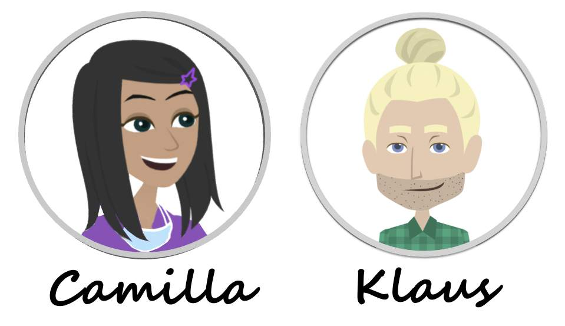

    --{{1}}--
Klaus works in Data Operations at World Data Emporium, the same company as Tsai. He knows Mel and Zena, and through them he met Camilla.

    {{1}}
__Klaus Ecklund__ works in Data Operations for the same company that __Tsai__ works for, World Data Emporium. 

He happens to be friends with both __Mel__ (whose parents own a smoothie shop) and __Zena__ (who works at the mall).


Through his friendships with __Mel__ and __Zena__, he met __Camilla Rodrigues__.


    --{{2}}--
Camilla is a nurse. She met Mel through his father's hospital care, helped Mel's family with a heart-healthy menu, rode bikes with Mel, and later helped him get GPS path data for a project.

    {{2}}
Camila works as a nurse, and met Mel when his father had a heart attack and was being cared for at the hospital. She agreed to help Mel's mother develop a heart-healthy menu for the family's diner/smoothie shop. Then, she started going on bike rides around town with Mel.  Eventually she helped Mel find and download GPS bike path data for a project he was working on.


    --{{3}}--
In this workshop they explore AI and machine learning in Snowflake on a shared project. One heads-up: Snowflake Education is moving away from Vyond, so after you set up your lab you will see new AI-generated versions of the characters.

    {{3}}
In this workshop, Klaus and Camilla will decide to learn more about Artificial Intelligence and Machine Learning tools available in Snowflake.  They'll work on a project together.

There's just one REALLY BIG ISSUE. 

Snowflake Education Services no longer uses Vyond software so Klaus and Camilla's characters will have to look different than they have looked in past workshops (and in the screenshots above). 

After you get your Snowflake Lab account set up, you'll be reintroduced to new versions of Camilla and Klaus. These will be AI versions of Camilla and Klaus developed using tools like OpenArt AI and Midjourney.

### 🔧 Set Up Your Trial Account

    --{{4}}--
Prerequisites: which earlier Snowflake Hands-On badges you should complete before this workshop.

    {{4}}
<h3>Pre-Requisites</h3>

We expect that you have already completed:

- [Badge 1: Data Warehousing Workshop](https://learn.snowflake.com/en/courses/OD-ESS-DWW/)
- [Badge 2: Collaboration, Marketplace & Cost Estimation Workshop](https://learn.snowflake.com/en/courses/OD-ESS-CMCW/)

We would love it if you had also completed:

- [Badge 3: Data Application Builders Workshop](https://learn.snowflake.com/en/courses/OD-ESS-DABW/)
- [Badge 4: Data Lake Workshop](https://learn.snowflake.com/en/courses/OD-ESS-DLKW/)
- [Badge 5: Data Engineering Workshop](https://learn.snowflake.com/en/courses/OD-ESS-DNGW/)

    --{{5}}--
Sign up for a Snowflake trial on AWS using the course link so defaults and the extended trial period apply.

    {{5}}
<h3>Sign Up for a Snowflake Trial Account on AWS</h3>

Please use this link to sign up for a trial account: [Snowflake Trial Signup](https://signup.snowflake.com/?trial=student&cloud=aws&region=us-west-2&utm_source=handsonessentials&utm_campaign=uni-dscw#).

__The link above will ensure that you use the right settings as well as giving you 120 days instead of the standard 30 days.__

__If you choose not to use the link above, be sure to choose ENTERPRISE, AWS, US West (Oregon).__

    --{{6}}--
In your trial: confirm warehouse, database, and SYSADMIN ownership for DORA.

    {{6}}
<h3>Setting Up Your Trial Account</h3>

1. Check to see if you have a warehouse named COMPUTE_WH that is sized XS and will auto-suspend. If you don't have one, create it.

2. Check to see if you have a database named UTIL_DB; if you don't, create one to serve as the home for your DORA GRADER function.

3. Make sure the SYSADMIN role owns the COMPUTE_WH, the UTIL_DB database, and the PUBLIC schema of the UTIL_DB database.

    --{{7}}--
Optional: set default role, warehouse, and namespace on your user so worksheets open in the right context.

    {{7}}
<h3>Setting Some Defaults</h3>

You may want to set some DEFAULT values for your USER. These can be set by clicking on your USERNAME in the bottom-left corner and choosing "My Profile." This ensures your worksheet context is set automatically.

If you prefer using SQL, you can run the following (replacing `KISHOREK` with your actual username):

```SQL
alter user KISHOREK set default_role = 'SYSADMIN';
alter user KISHOREK set default_warehouse = 'COMPUTE_WH';
alter user KISHOREK set default_namespace = 'UTIL_DB.PUBLIC';

```

### 🤖 Set Up DORA!

If you've take another of our Hands-On Badge workshops, you've already met DORA!

DORA (Snowflake's __D__iagnostic __O__nline __R__esults __A__ssessor) connects your trial account to various Snowflake systems that keep track of your course progress (including tracking DORA tests) and issue completion badges.

Setting up DORA in your trial account can be done in 3 steps:

<h4>1. Run the API Integration Script</h4>

This allows your trial account to communicate with the external Snowflake systems.

```SQL
use role accountadmin;

create or replace api integration dora_api_integration
api_provider = aws_api_gateway
api_aws_role_arn = 'arn:aws:iam::321463406630:role/snowflakeLearnerAssumedRole'
enabled = true
api_allowed_prefixes = ('https://awy6hshxy4.execute-api.us-west-2.amazonaws.com/dev/edu_dora');

```

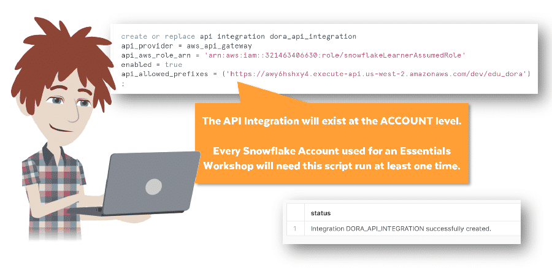

<h4>2. Set up the Grader Function</h4>

This allows your trial account to check your work against an answer key.

```SQL
create or replace external function util_db.public.grader(
      step varchar
    , passed boolean
    , actual integer
    , expected integer
    , description varchar)
returns variant
api_integration = dora_api_integration 
context_headers = (current_timestamp, current_account, current_statement, current_account_name) 
as 'https://awy6hshxy4.execute-api.us-west-2.amazonaws.com/dev/edu_dora/grader'
; 

```

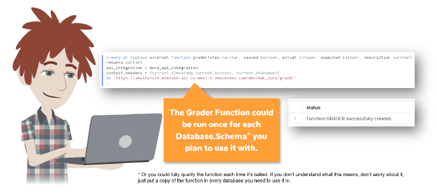

<h4>3. Test the connection</h4>

This confirms that DORA is set up correctly.

```SQL
create or replace external function util_db.public.grader(
      step varchar
    , passed boolean
    , actual integer
    , expected integer
    , description varchar)
returns variant
api_integration = dora_api_integration 
context_headers = (current_timestamp, current_account, current_statement, current_account_name) 
as 'https://awy6hshxy4.execute-api.us-west-2.amazonaws.com/dev/edu_dora/grader'
; 
```

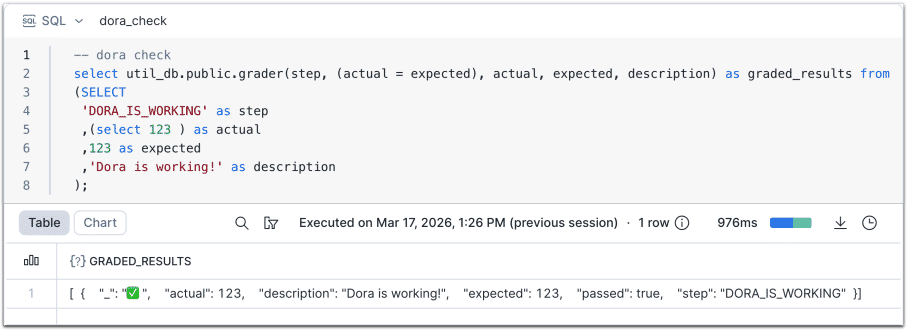

### 🤖 DORA is Listening!

<h3>🧰 Tell Us About Your Snowflake Trial Account</h3>


You have the __[http://learn.snowflake.com](http://learn.snowflake.com)__ account (where these words appear), and you have your Snowflake Trial Account where you are doing labs. How will DORA know which labs go with which learning account?

There's an app for that! Use the pages in the app to:

- ✏️ Edit Your Name and/or Email
- ⭐ Format Your Display Name - This is how your name will appear on your badge!
- 🔗 Create a LINK between your learning account and your Snowflake Trial Account
- 🤖 View the DORA Lab Checks you have run to see how you are progressing

<p class='text-center'>Visit __[https://ysa.snowflakeuniversity.com](https://ysa.snowflakeuniversity.com)__</p>

You will need your __UNI_ID__ and __UUID__ to log into the YSA App, which you can find on the course registration page at training.snowflake.com:

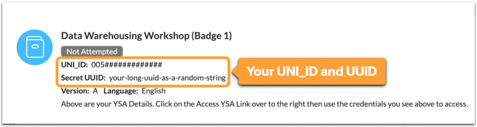

We recommend that you store this info in a safe place, as you will need it any time you access the YSA App to check your course progress & badge status.

If you completed any of the other Hands-On Badges, you used the app to update your name, email and display name. You also created a LINK ROW to tell DORA what Snowflake Trial Account you were using to complete your labs.  

For this workshop, __start by creating a new DSCW link row in the YSA App__. When you create a LINK ROW you are telling DORA what Snowflake Trial you are using to complete your DSCW. This needs to be done even if you are still using the same Snowflake Trial Account.  

Once you've completed your LINK row, proceed with the course, but remember, you can __come back to the app to see your DORA tests__ and make sure they are coming through __PASSED and VALID__ as often as you'd like. Note however, that they DORA Setup Test does not appear. Only the numbered tests will appear since they are the tests that count toward the badge.

### 📷 Camilla and Klaus v2.0

Remember the old versions of Camilla and Klaus...well we entered prompts into Midjourney to develop new versions of them. See the prompts and results below.


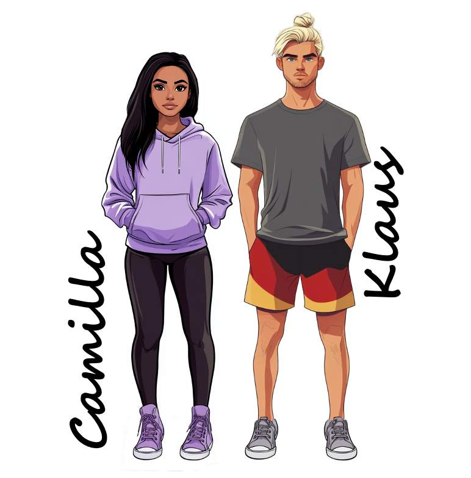

In the course designer/developer's headcanon, Klaus has always been Scandinavian and Camilla has always been South American.

So, in generating new characters, the prompts we used were:

> latino young lady with straight black hair, brown eyes and brown skin. 2D simplistic vector illustration style, full body shot. Black leggings, light purple hoodie, light purple chuck taylor all-stars

and: 

> danish young man with straight platinum blonde hair worn in a man bun, blue eyes and pale skin. he has razor stubble. 2D simplistic vector illustration style, full body shot. Soccer shorts in red, gold and black, gray t shirt. He is wearing chuck taylor all stars. He is fit but not super muscular.

However, when development for this course started, the course designer/developer decided that the story line would revolve around the sport that is called "soccer" in the US.

Klaus and Camilla would both play in soccer leagues in their hometown of Denver, Colorado, USA and the badge storyline would revolve around __"soccer"__ statistics. 

For extra fun, it was decided that Klaus should be __German__ and Camilla should be __Brazilian__, and when they refer to the sport, we would call it __'futebol'__ (as Camilla would say) or __Fußball__ (as Klaus would say).

## Lesson 2 - Snowflake's Cortex Playground

### 🛝 A Tale of Two Playgrounds


Camilla is at Cheeseman park in Denver, Colorado when she sees someone she recognizes. It's Mel's friend, Klaus!


__Klaus__: Camilla? Is that you? What are you doing here?

__Camilla__: Oh hey! I coach my nephew's futebol team. We're just finishing up. My players are packing their gear right now. 

__Klaus__: That's so cool. I didn't know you were a Fußball coach. Do you also play?

__Camilla__: Of course! I love to play! I'm also a big fan and I love to watch matches. 

__Klaus__: We should watch some world cup matches together when it starts next week. We can invite Mel and Zena, too!

__Camilla__: Definitely!  So, are you still using Snowflake? 

__Klaus__: Of course, I love Snowflake. Are you still doing that Data Science course you were telling me about?

__Camilla__: Yeah, but it's a lot of boring lecture. I wish it was more hands on. I learn better when I can try things out.

__Klaus__: Oh me too! Have you seen the Cortex Playground yet? 

__Camilla__: You mean Cheesman Park? There's a new playground here? 

__Klaus__: Haha. No. Cortex is what Snowflake is calling a lot of their AI/ML tools. There's a hands-on tool in Snowflake called Cortex playground. 

__Camilla__: Sounds fun! I really want to try that. 

__Klaus__: Hey, I'm about to go get a smoothie. If you want to come, I can show you the Cortex Playground on my laptop. 

__Camilla__: Yeah, let me say goodbye to my nephew and the other players and I'll meet you there.

<div class="lia-bubble lia-bubble--right">
  <div class="lia-bubble__body">
    <p class="lia-bubble__msg">Camilla? Is that you? What are you doing here?</p>
  </div>
  
</div>

<div class="lia-bubble lia-bubble--left">
  
  <div class="lia-bubble__body">
    <p class="lia-bubble__msg">Oh hey! I coach my nephew's futebol team. We're just finishing up.</p>
  </div>
</div>

### 🛝 Cortex Playground 

#### 🤖 AI and ML Studio

<h3>Navigate to the Cortex Playground</h3>

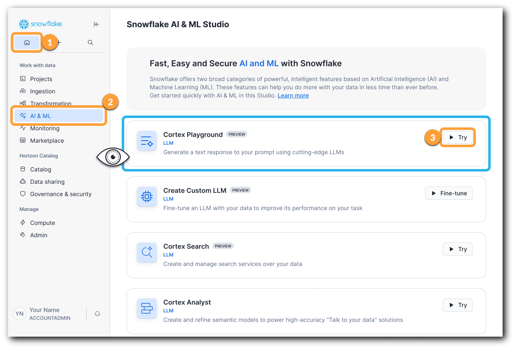

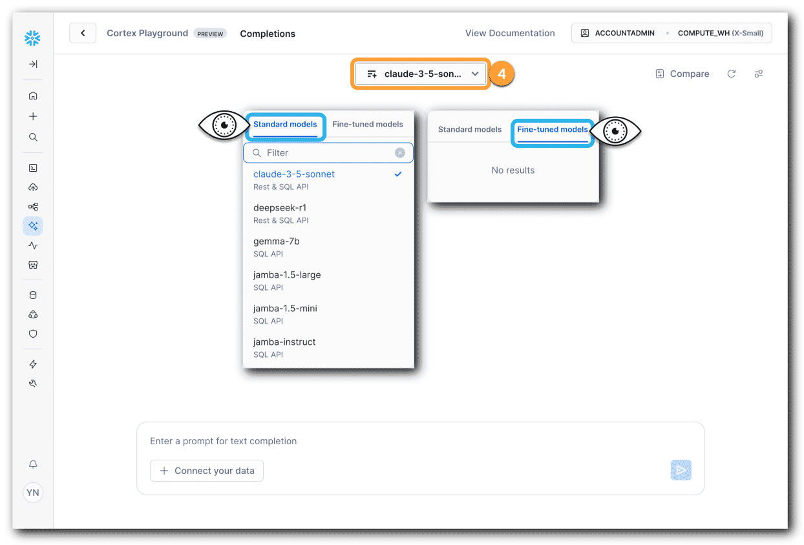

<h4>Multiple Choice</h4>

Which of the options below are included as standard models available in Cortex Playground?

Select all that apply.

    [[X]] claude-3-5-sonnet
    [[X]] deepseek-r1
    [[ ]] gemma-7b
    [[ ]] OpenAI ChatGPT
    [[X]] mistral-large2
    [[X]] snowflake-llama-3.3-70b

<h4>Multiple Choice</h4>

How many fine-tuned models are available in your trial?

[[X]] None
[[ ]] A few
[[ ]] More than 5
[[ ]] More than 10

#### 🛝 LLM Options

<h3>🥋 Type in a Simple Prompt Like "Hi Claude"</h3>

The default model is claude-3-5-sonnet (this may change, that's okay). Using whatever model is already chosen, type in a simple prompt to see what response you recieve. Then choose a few different models and repeat your same prompt.

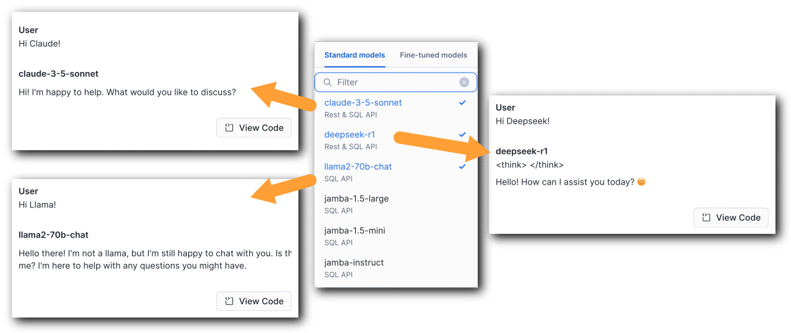

__The upcoming DORA tests confirms whether you've interacted with at least 5 different models in the Cortex Playground.__

At a minimum, make sure you've interacted with:

- snowflake-arctic
- snowflake-llamna 3.1-405b
- llama3-70b
- llama4-scout
- openai-gpt-oss-20b

<h3>🎯 Do Some Research On Your Own</h3>

Maybe you are already familiar with various Large Language Models (LLMs) and their developers. If not, look up the owners of Claude LLM, Gemma LLM, Jamba LLM and more. Continue researching other models as far as your curiosity takes you.

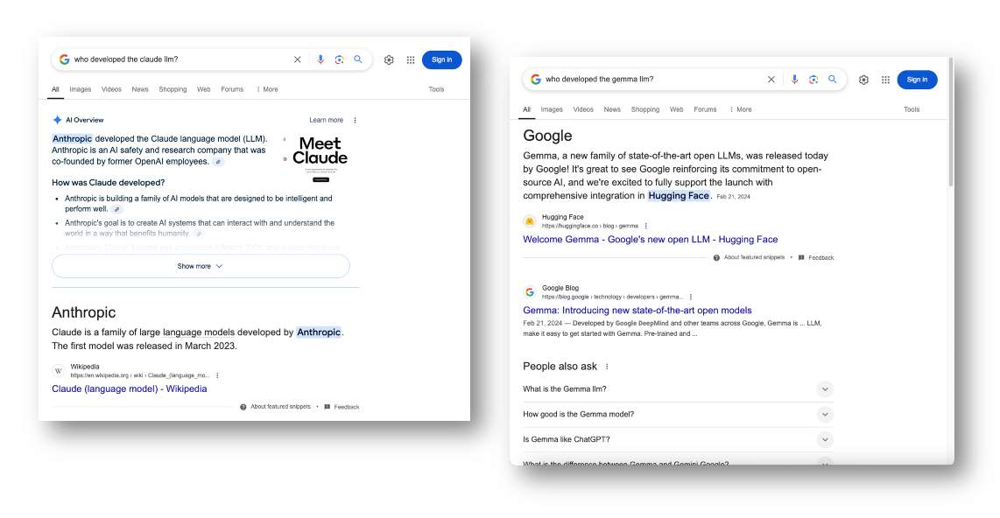

#### 🛝 Chatting with Models

<h3>🥋 Directly Compare 2 Models' Responses</h3>

Clear the screen, then set up the screen for comparing two responses at once.

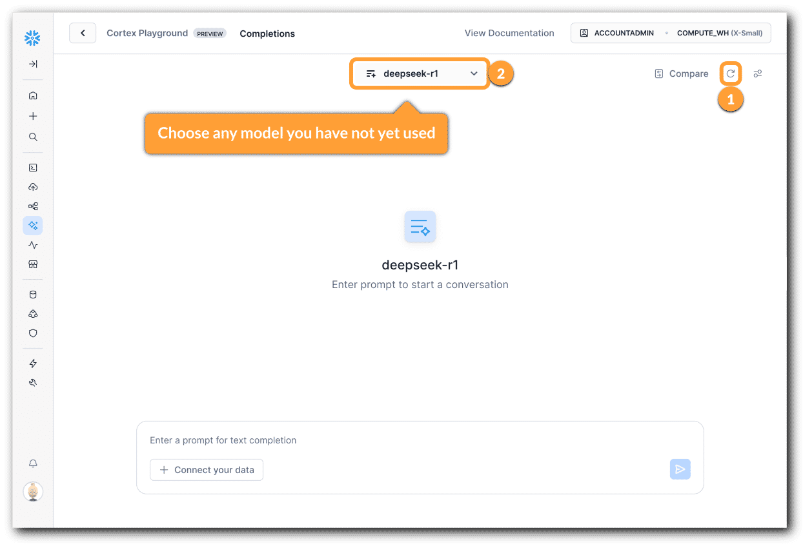

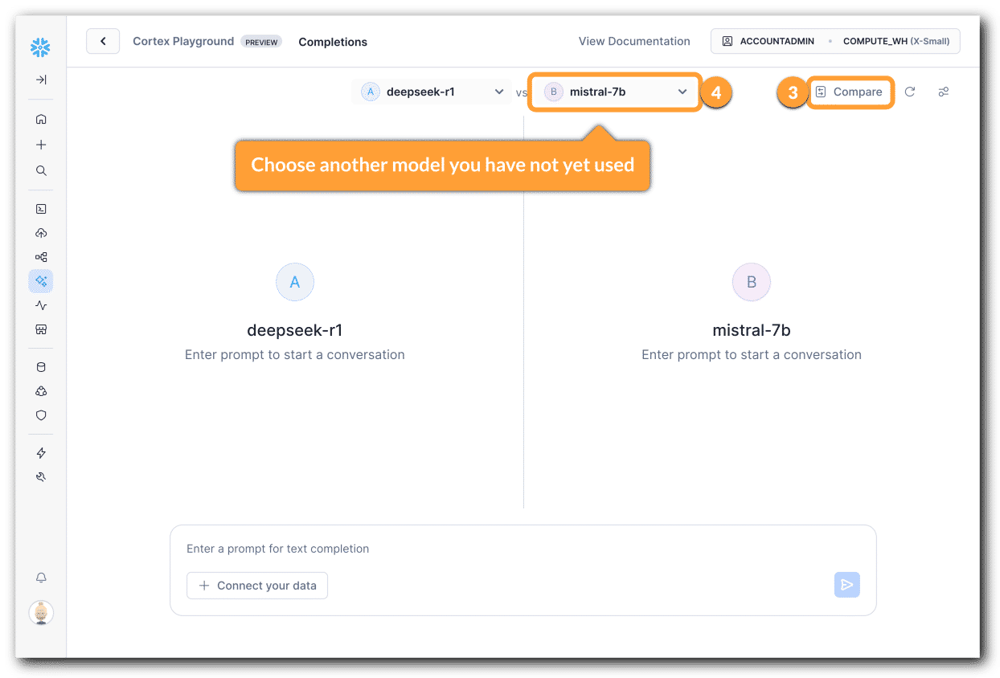

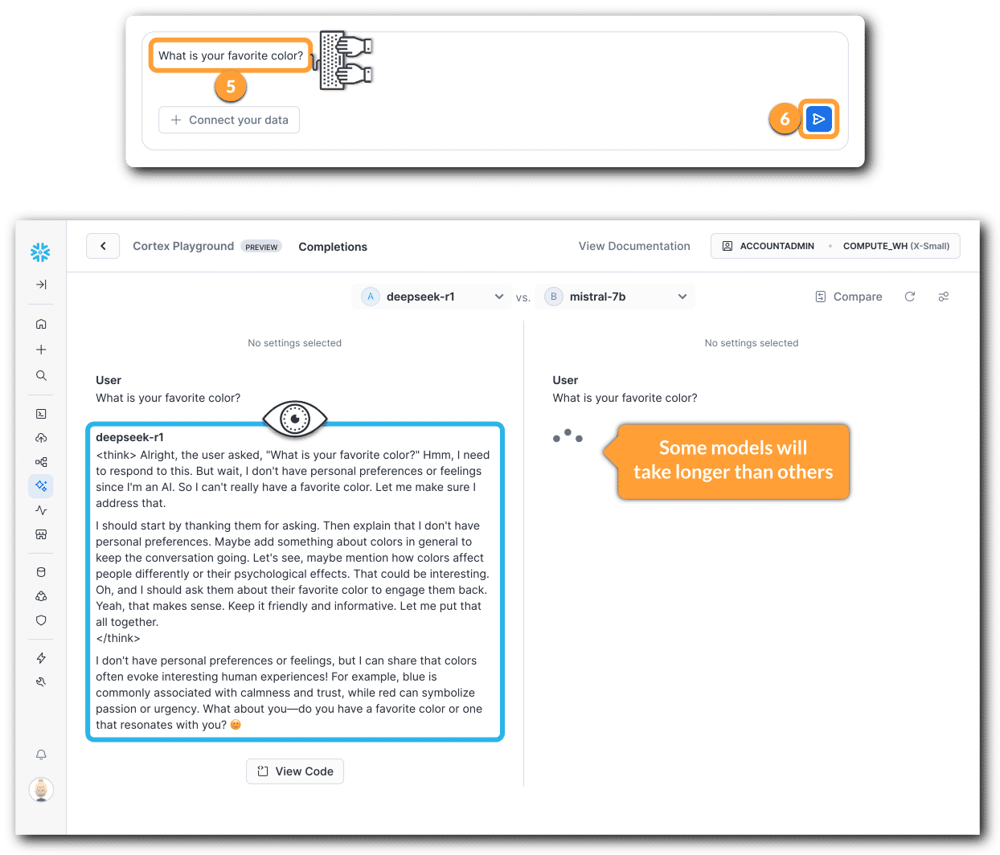


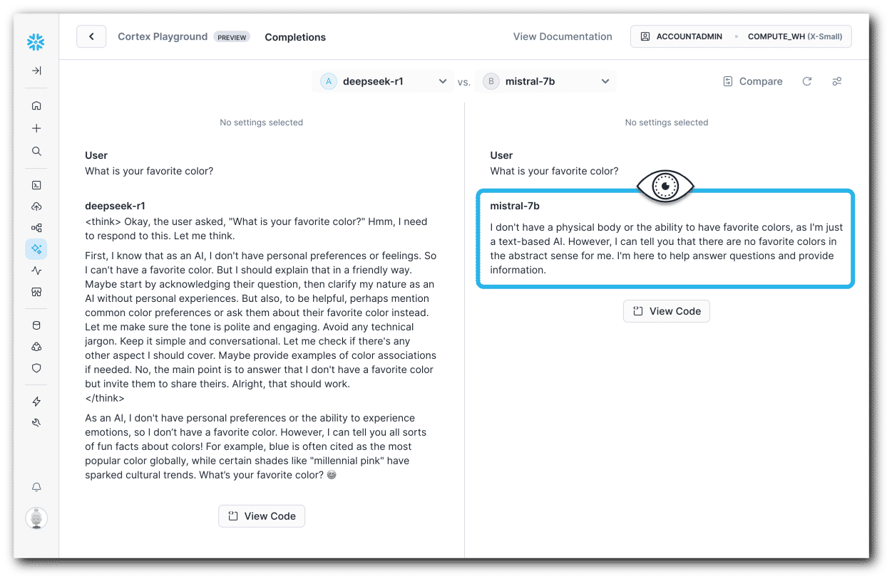

<h3>📓 What is Prompt Engineering?</h3>

When we send message to AI LLMs, the messages are called __PROMPTS__.
- "hi claude" is a prompt.
- "What is your favorite color?" is also a prompt.

Neither of these prompts are very good because they don't take advantage of the power of AI LLMs. To understand good and bad prompts and get better at constructing them is called __PROMPT ENGINEERING__.

<h3>🥋 Engineer a More Effective Prompt</h3>


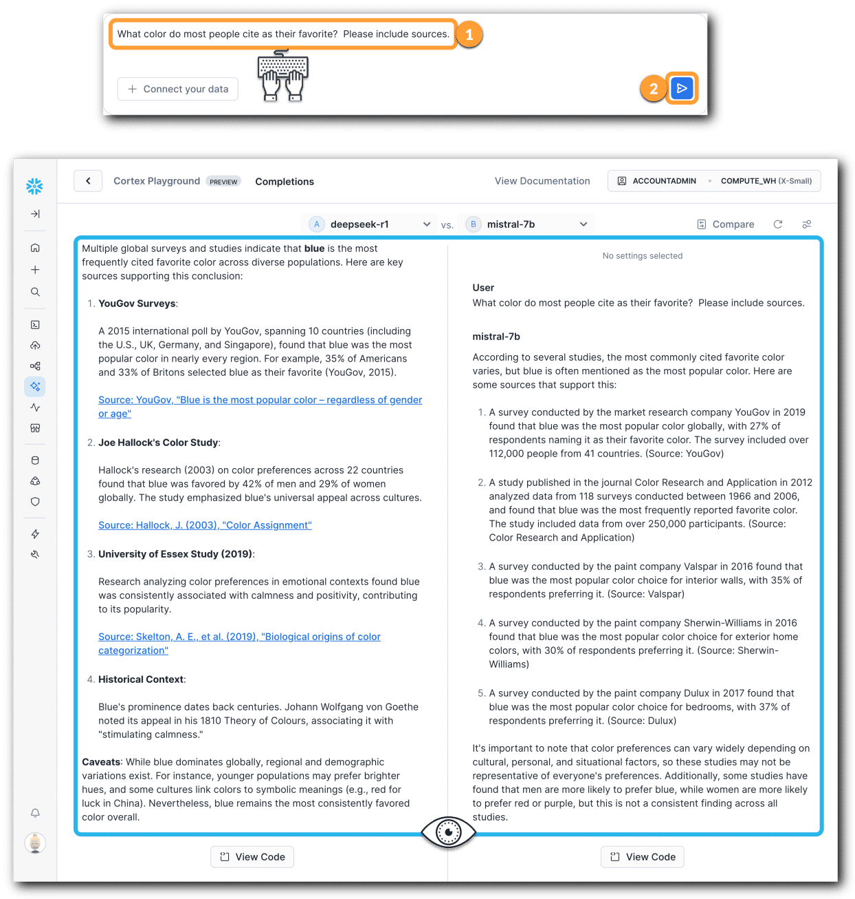

### 💰 LLM Availability & Usage Quotas

<h3>📓 How Do You Decide Which Model to Use?</h3>

There are a lot of considerations and we can't cover them all here. Nor can we cover them as well as the documentation does.

So, we'll point you to the [documentation](https://docs.snowflake.com/en/user-guide/snowflake-cortex/llm-functions) so you'll know where to go to research further.

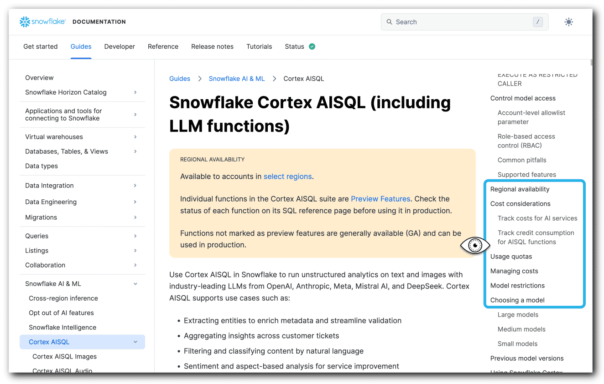

<h3>🎯 Which Regions Have Access to Which Models?</h3>

Use the 'Regional Availability' section of the documentation to check the table and answer the question below.

<h4>Multiple Choice</h4>

According to the table in the Regional Availability section of the Docs page, which region has access to the most LLM models?

[[X]] Cross Cloud (Any Region)
[[ ]] AWS US (Cross Region)
[[ ]] AWS EU (Cross Region)
[[ ]] AWS APJ (Cross Region)
[[ ]] Azure US (Cross Region)

<h4>Multiple Choice</h4>

In which ways might usage quotas affect your use of LLMs during this workshop?

Select all that apply.

[[X]] A high utilization period might mean my access is throttled.
[[X]] AWS US (Cross Region)
[[X]] Because I am using a trial account, I will only be able to use up to 10 credits per 24 hour period.

### 💰 LLM Costs

<h3>📓 Understanding the Cost of Using LLMs</h3>

There are several different LLM functions available in Snowflake. The playground prompts we just ran were carried out __using the COMPLETE function__. You can see it mentioned in the top bar of the playground interface.

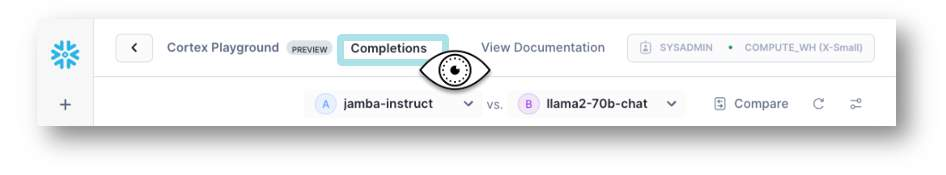

Under the __[Cost Considerations](https://docs.snowflake.com/en/user-guide/snowflake-cortex/aisql#label-cortex-llm-cost-considerations)__ section on the Docs page there is a hyperlink to a pdf that lists the cost of EVERY Snowflake component, including the use of the COMPLETE function (which we just used via Cortex Playground).

__Note that the costs associated with different models and functions is updated periodically; the prices noted in this course may not reflect recent updates.__

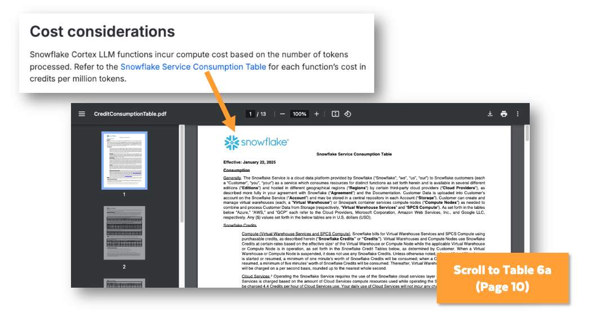

When looking at Table 6a we need to focus on lines that mention the COMPLETE function since this is the one being used in Cortex Playground.

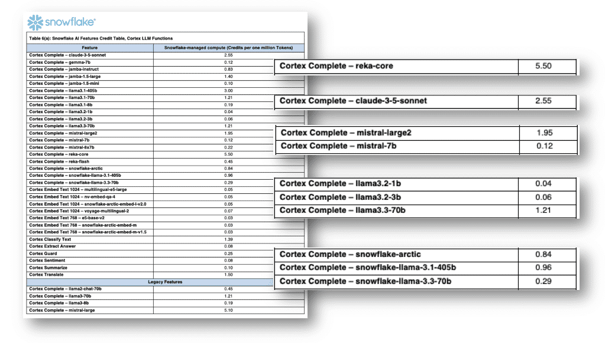

You may remember that in Badge 2: CMCW we learned that when using an eXtra-small Snowflake Warehouse one credit is roughly one hour of time. Credit usage for LLM models is very different.

For LLM models, credits are consumed based on how long and complex your question is and also how long and complex the answer is. In fact, each word (or sometimes phrase) is counted as a TOKEN. So an 8-word question with a 200-word response could clock in at 208 tokens used. For simplicity, we'll presume that each word equals one token.

Notice that in table 6a, the heading shows how many credits are used per MILLION TOKENS sent or received.

__For the questions that follow, use the information displayed in this lesson, not the most recent Cost Considerations document at [docs.snowflake.com.](http://docs.snowflake.com)__

<h4>Multiple Choice</h4>

You send multiple prompts to, and receive responses from the reka-core model. 
Afterwards, you count up the number of words sent and recieved. 
You find that you have sent and recieved 190K words. 
How many credits are you likely to have consumed?

[[ ]] Not quite one credit.
[[X]] All of 1 credit, and less than 10% of another credit.
[[ ]] All of 1 credit, and more than 80% of another credit.
[[ ]] All of 2 credits, and less than 50% of another credit.
[[ ]] All of 5 credits, and about half of another credit.

<h4>Multiple Choice</h4>

Your boss has asked you to find the cheapest per-credit cost model, but the model you choose cannot benefit Facebook because Facebook is one of your company's competitors. 
Using the table shown above and your own research, pick the best model for your company. 
Which model will you choose?

[[ ]] reka-core
[[ ]] claude-3-5-sonnet
[[ ]] mistal-large2

<h4>Multiple Choice</h4>

According to Snowflake Documentation and this course, what factors would it make sense to consider when choosing which LLM model to use for some AI work?

Select all that apply.

[[X]] The number of tokens per credit each model uses.
[[ ]] The cost of each credit in the region where your Snowflake account is hosted.
[[X]] Whether certain models are available in the region where your Snowflake is hosted.
[[X]] Which models are owned by your company's competitors or allies.

### 🤖 DORA DSCW01

This DORA tests confirms whether you've interacted with at least 5 different models in the Cortex Playground.

At a minimum, make sure you've used:

1. snowflake-arctic
2. snowflake-llama 3.1-405b
3. llama3-70b
4. llama4-scout
5. openai-gpt-oss-20b

<div class="lia-banner lia-banner--warn" role="alert">
  <span class="lia-banner__icon" aria-hidden="true">
    <svg xmlns="http://www.w3.org/2000/svg" width="28" height="28" viewBox="0 0 24 24" fill="none" aria-hidden="true">
      <circle cx="12" cy="12" r="9.5" stroke="currentColor" stroke-width="1.25" fill="none"/>
      <path d="M12 7.5v5.5" stroke="currentColor" stroke-width="1.5" stroke-linecap="round"/>
      <circle cx="12" cy="16.75" r="1" fill="currentColor"/>
    </svg>
  </span>
  <p class="lia-banner__msg">Never edit DORA code to get a green check. Edit your lab work.</p>
</div>

```SQL
-- Set your worksheet drop lists
-- DO NOT EDIT ANYTHING BELOW THIS LINE
select GRADER(step, (actual = expected), actual, expected, description) as graded_results from (
   SELECT 'DSCW01' as step 
        ,( select  iff(count(*)>=5, 5, 0)
            from (
              select model_name
              from SNOWFLAKE.ACCOUNT_USAGE.CORTEX_AISQL_USAGE_HISTORY
              where function_name ilike '%AI COMPLETE%'
              group by model_name
                 )
          ) as actual 
        , 5 as expected 
        ,'Used Different models when exploring Cortex Playground' as description
);
```

### 📚 More to Learn


__Camilla__: I love Cortex Playground and I've learned more in the last half hour than in 3 hours of lecture classes!

__Klaus__: Yeah, I'm planning to play around with some of the other Cortex Playground options.

__Camilla__: Me, too! You know, I've got a lot of data related to my futebol coaching stuff. I wonder if I could use Cortex tools to help me upload and analyze my data quickly.

__Klaus__: That sounds like a great idea. I'd love to help, if you want me to.

__Camilla__: Right now I've been working with Zena to get our June tournament webpage up online, but I know as soon as I post it, I'm going to get so many questions from parents and players.

__Klaus__: Like what kind of questions?

__Camilla__: Really easy stuff. Like which teams are playing at which fields. It's all on the webpage, but I still get a ton of questions. Zena put a chatbot on the site, but it doesn't seem to be able to answer the questions.

__Klaus__: Oh! I'll bet Cortex Analyst could help with that.

__Camilla__: How?

__Klaus__: We'll just create a semantic model to help your chatbot find the answers.

__Camilla__: That sounds amazing. I need to put the data into Snowflake tables first. Zena asked me to do that but I haven't had time yet. Why don't I try to do it on my own, and if I get stuck, I'll text you?

__Klaus__: Perfect!

## Lesson 3 - Cortex Analyst

### 🛠️ Camilla Builds Her Database


<h3>🎯 Create a Database and Warehouse for the Data Science Projects</h3>

In previous workshops, you learned to create databases and warehouses so use those previously learned skills to complete the following tasks on your own.

- Use the __SYSADMIN__ role for all of these tasks.
- Create a database called __CAMILLAS_DB__.
- Drop the PUBLIC schema and create a new schema called __CORTEX_ANALYST__.
- Create a Snowflake Managed Stage in the CORTEX_ANALYST Schema and name it __CORTEX_ANALYST_MODEL_STAGE__. Use client-side encryption.
- Create an eXtra-Small Warehouse and call it __LLM_WH__.

<h3>🥋 Create and Populate a Teams Table</h3>

```SQL
create or replace table camillas_db.cortex_analyst.camillas_teams
( 
    team_id number,
    team_name varchar(50),
    kit_color varchar(20),
    coach varchar(100),
    emoji_symbol varchar(5)
);

insert into camillas_db.cortex_analyst.camillas_teams
values
(1,'Blue Sky Strikers','cerulean','Stormy McLeod', '💙☁️⚡️'),
(2,'Pitch Blazing Bombers','emerald','Kelly Groen','🌱🔥💣' ),
(3,'Solar Flashing Flares','marigold','Ravi Bahsin', '☀️🔥'),
(4,'Terracotta Tirade','terracotta','Clay Skála', '🪴💪');
```

### 🏆 Add Tournament Tables

<h3>🥋 Add a Table for Tournament Match Locations</h3>

```SQL
create or replace table camillas_db.cortex_analyst.match_locations
(
 location_id number, 
 location_name varchar(50)
);

insert into camillas_db.cortex_analyst.match_locations
values 
(1, 'Main Street Park - Pitch 1'),
(2, 'Main Street Park - Pitch 2'),
(3, 'Central Park - North Pitch'),
(4, 'Central Park - South Pitch');
```

<h3>🥋 Add a Table for the Tournament Schedule</h3>

```SQL
create or replace table camillas_db.cortex_analyst.match_schedule
( 
    home_team_id number,
    away_team_id number,
    location_id number,
    match_datetime timestamp_ntz  
);

insert into camillas_db.cortex_analyst.match_schedule
values
(1,2,1,'2025-06-07 08:00:00'),
(3,4,2,'2025-06-07 08:00:00'),
(2,3,3,'2025-06-07 12:00:00'),
(1,4,4,'2025-06-07 12:00:00'),
(1,3,1,'2025-06-07 16:00:00'),
(2,4,2,'2025-06-07 16:00:00');
```

### 💻 Create a Semantic Model Using Cortex Analyst

<h3>🥋 Navigate to Cortex Analyst</h3>


<h3>Create Your Semantic Model</h3>

1. Select __Create new -> Create new Semantic Model__
2. Use your __SYSADMIN__ role and __LLM_WH__ Warehouse
3. Use your __CAMILLAS_DB.CORTEX_ANALYST__ Database and Schema
4. Use your __CORTEX_ANALYST_MODEL_STAGE__ Stage

<h3>Values to Copy and Paste while Creating Your Semantic Model</h3>

| Field Name | Information to Input |
| --- | --- |
| Semantic model Name | camillas_june_tournament |
| Semantic Model Description | This semantic model covers the table related to a futbol (soccer) tournament happening in June of 2025. Camilla is trying to develop some data agents for the tournament's website. This semantic model is just our attempt to explore how Cortex Analyst might help us do something cool. |

5. Name your Semantic Model with the values given above
6. Add the Description of your Model with the values given above
7. Click __Next__ to continue

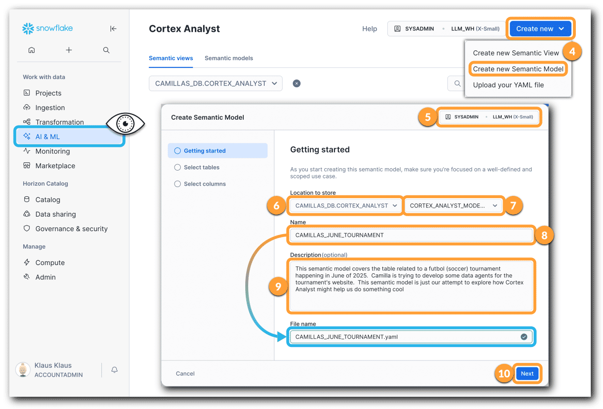

<h3>Select Tables</h3>

8. Make sure all of your tables are selected: CAMILLAS_TEAMS, MATCH_LOCATIONS, and MATCH_SCHEDULE
9. Click Next to Select Columns


<h3>Select Columns</h3>

10. Name your Semantic Model with the values given above
11. Click Create and Save to continue

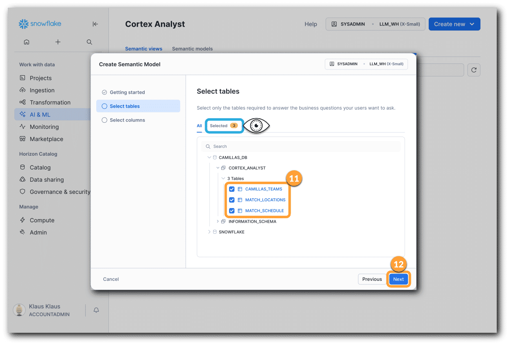


<h3>Confirm Changes</h3>

You will see a success message, letting you know that your Semantic Model has been successfully created and saved.

12. Click the arrow button to hide the model's chat window.

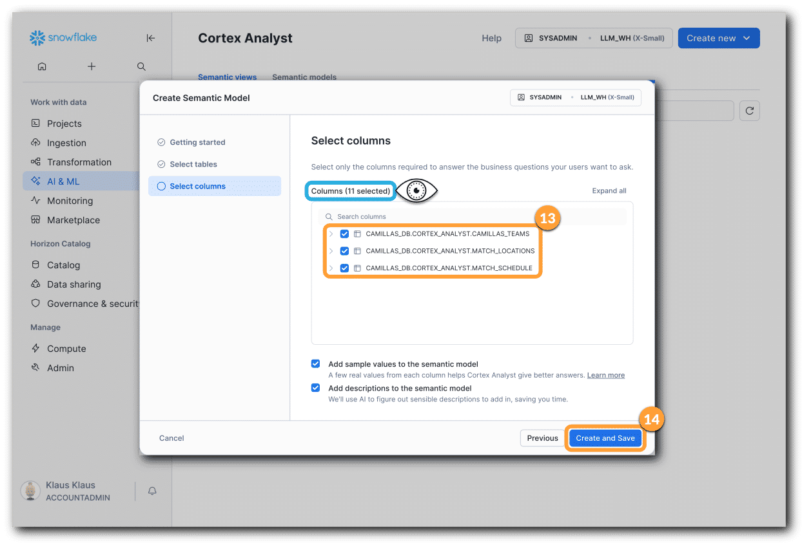

<h3>Save and Exit</h3>

You will see a success message, letting you know that your Semantic Model has been successfully created and saved.

13. Make sure to save any changes before exiting this view

14. Click this left arrow to return to your home screen

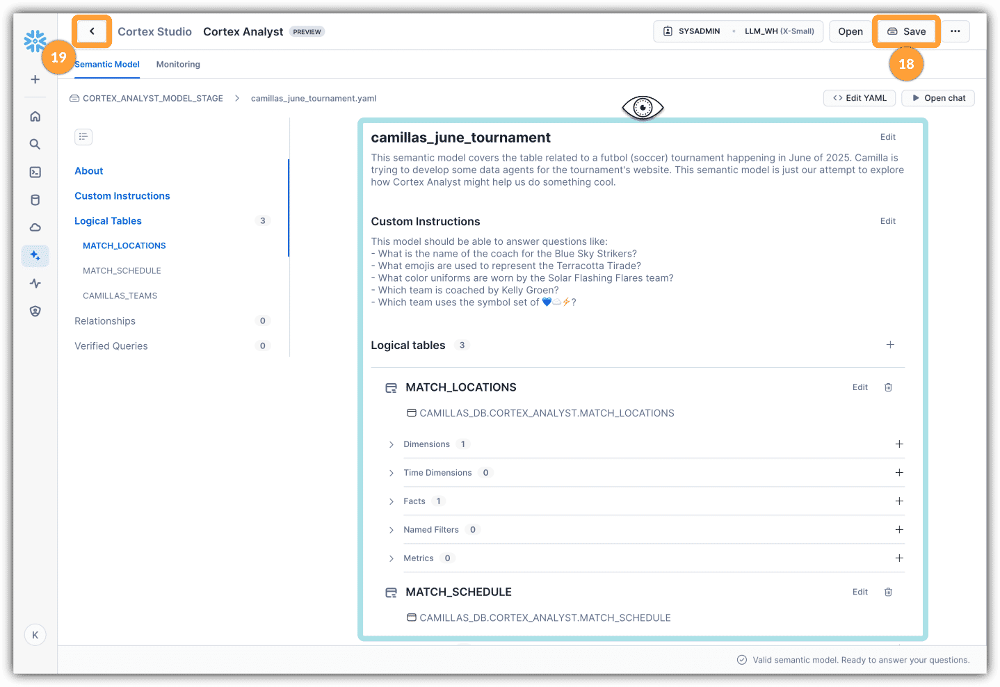

### 💻 Reload and Test Your Semantic Model

<h3>📓 The Semantic Model as a YAML File</h3>

When you created the Semantic Model, it was written to a YAML file and stored in the Stage you created. Make sure you can see it there. If you can't see it, check the ownership of various objects.

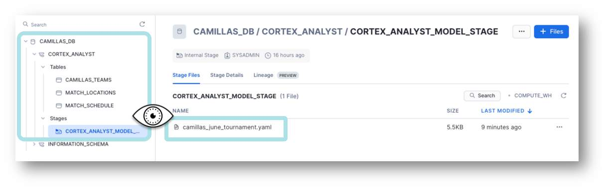

If you don't see any files, click the refresh symbol next to the warehouse name near the upper right corner.

<h3>🥋 Reload Your YAML File / Semantic Model</h3>

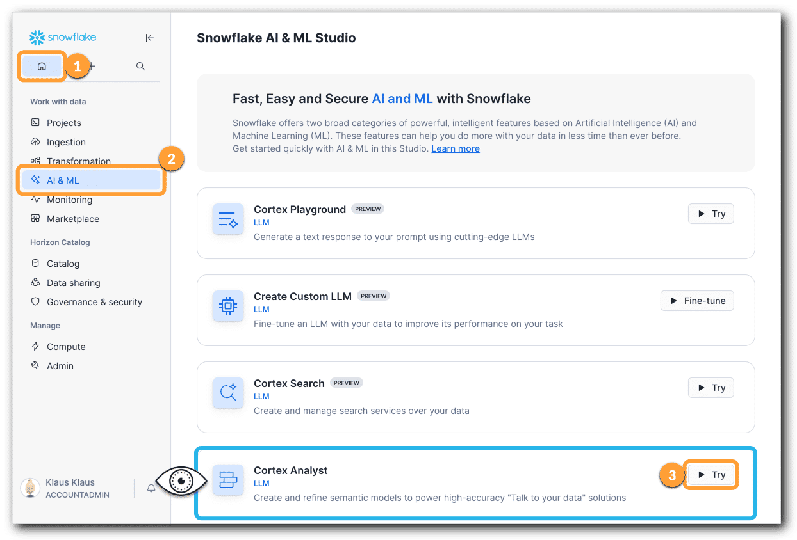

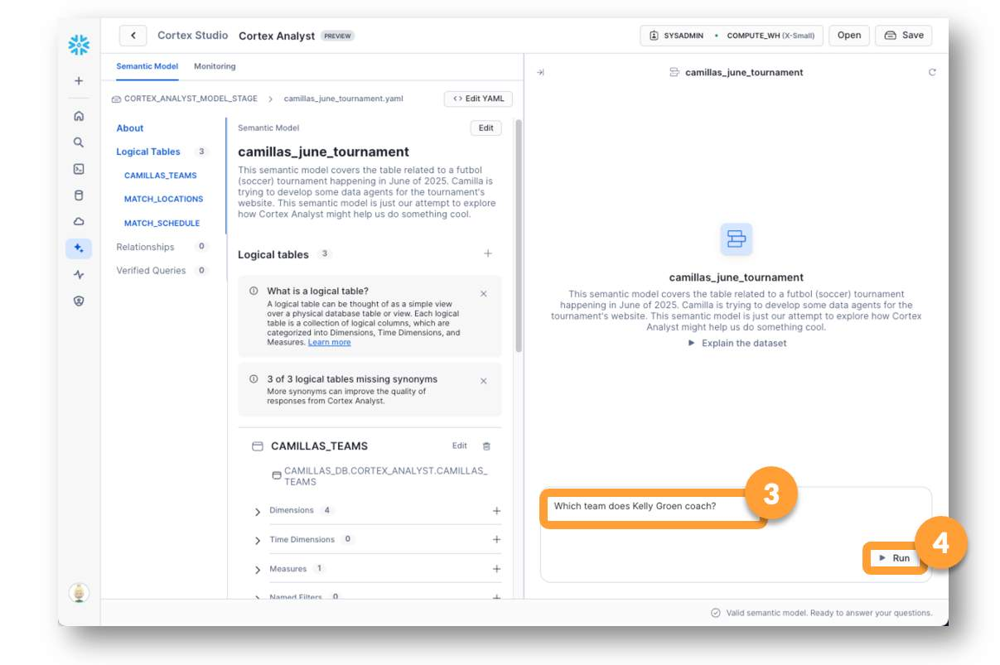

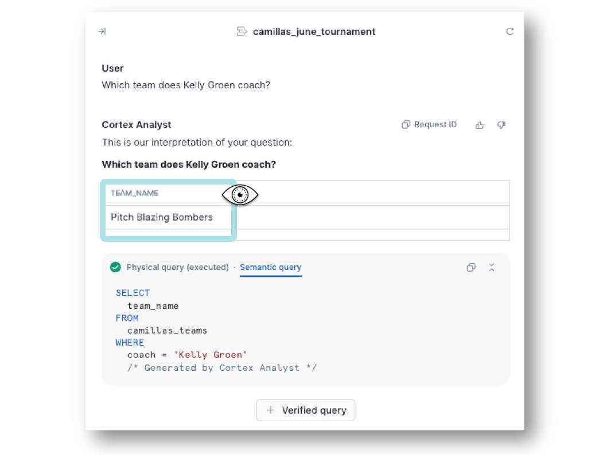

<h3>📓 But It Gets Even Cooler...</h3>

Did you know you can mis-spell words and sometimes Cortex will still be able to figure out what you mean?

Look at this:

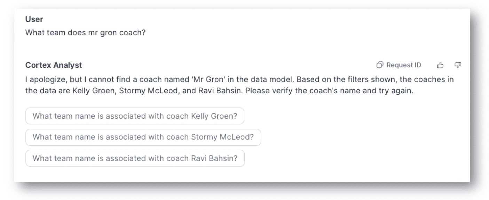

### ✏️ Edit Column Classifications

<h3>📓 Dimensions & Measures</h3>

Part of Cortex Analyst's work is to guess whether a column in a table is a Dimension or a Measure.  Dimensions are usually names that you might use to filter data. Measures are usually numbers that you might use to do math like averaging things or finding the largest or smallest number.

After the tournament, there will be measures like goals, shots missed, shots on target, assists and more. Right now though, the only numbers are just the ID columns we set up to join the tables together. We need to reclassify the ID columns to Dimensions so we can tell Cortex Analyst how these IDs tie the tables together.

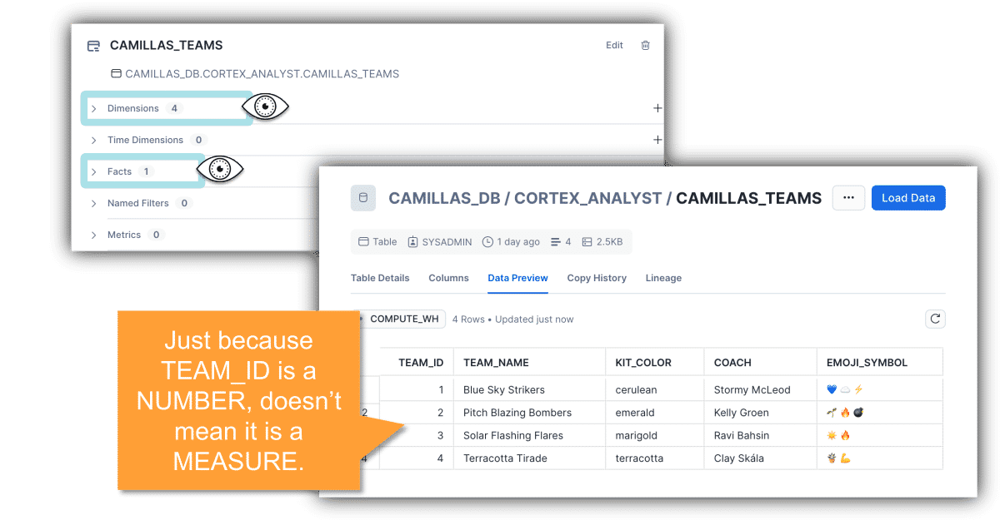

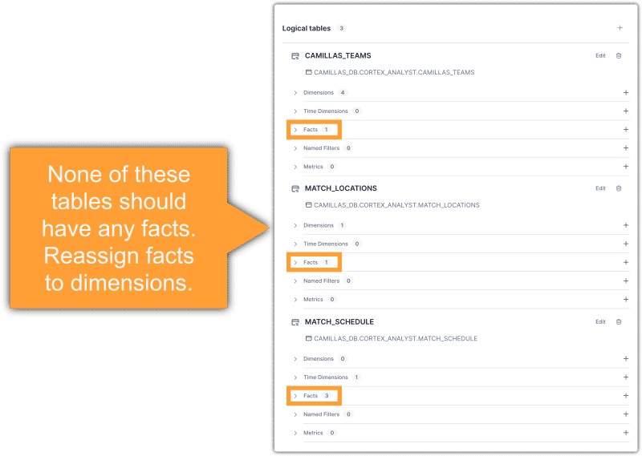

<h3>🥋 Convert the ID Columns to Dimensions</h3>

Locate all the ID columns and reclassify them as Dimensions.

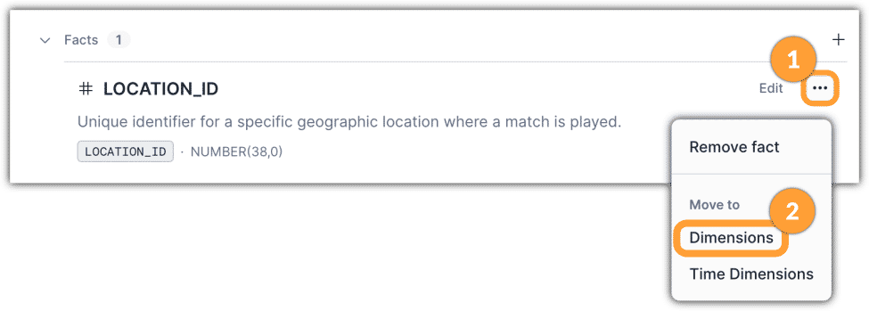

<h3>📓 Why ID Fields are also Dimensions</h3>

ID fields can be used for sorting or filtering. They usually convey less information and look worse in presentation. For this reason, people don't really use them as dimensions when creating reports.

For the purpose of your semantic model, even though ID fields are ugly, they are still dimensions and so we need to classify them as dimensions if we want to be able to use them represent the relationships between our tables.

<h4>Multiple Choice</h4>

Measures are generally columns that calculations can be performed upon (sum, average, find the min and max of). Mark all the columns described below that seem like measures.

[[X]] GOALS_SCORED
[[X]] GAMES_LOST
[[X]] NUM_TOURNAMENT_APPEARANCES
[[ ]] PLAYER_NAME
[[ ]] LOCATION_NAME
[[ ]] TEAM_NAME

<h4>Multiple Choice</h4>

Dimensions are generally columns that are used for filtering and sorting. Mark all the columns described below that seem like dimensions.

[[ ]] GOALS_SCORED
[[ ]] GAMES_LOST
[[ ]] NUM_TOURNAMENT_APPEARANCES
[[X]] PLAYER_NAME
[[X]] LOCATION_NAME
[[X]] TEAM_NAME

### 🔬 Define Table Relationships

<h3>📓 It Coulda Beena View!</h3>

Now it's time to create table relationships in Cortex Analyst. If you are accustomed to using SQL, you might feel like this is a weird way to "join" tables.  

Any SQL developer with access to the underlying data could make a view and use that. But in this case, instead of creating a SQL view, we need to create the relationships through Cortex Analyst.  This is a good thing because it allows people who don't know SQL to build semantic models and do other analysis work.

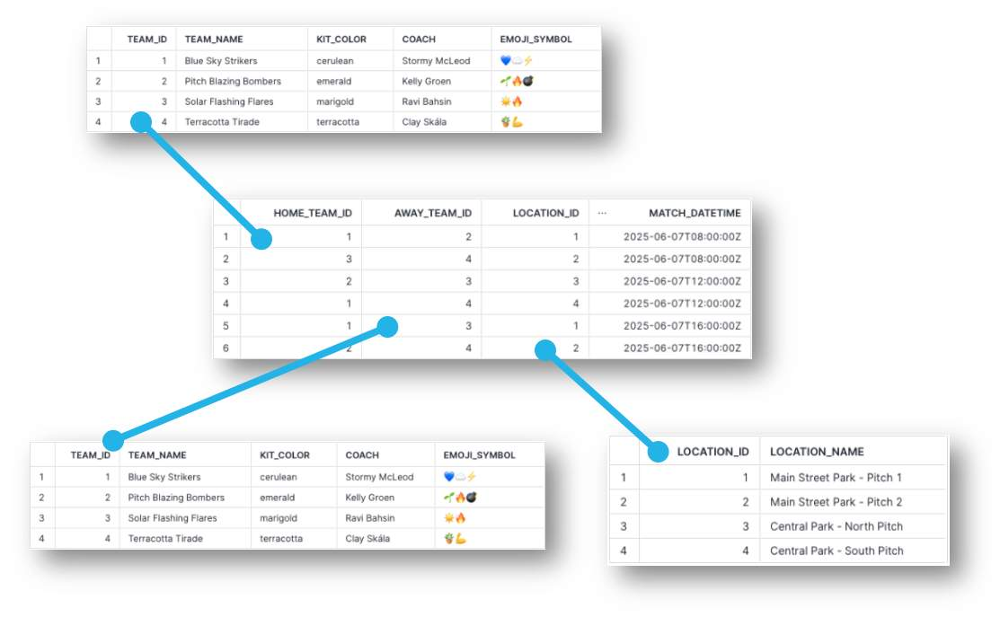

Note that In the diagram above it looks like we are joining four different tables because the Teams table is used twice.

We use Teams table once to link the Home Team ID to its name, and a second time to link the Away Team ID to its name.

<h3>🥋 Use Cortex Analyst to Create the Relationships, Instead</h3>

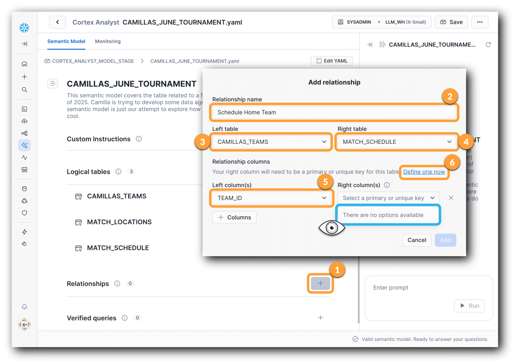

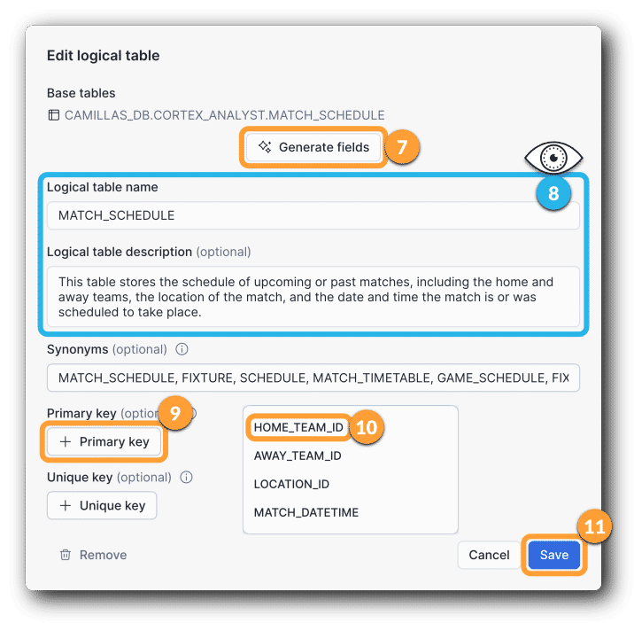

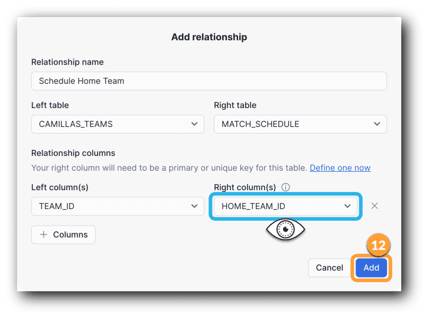

Now repeat the process to create the other two tables shown in this picture:

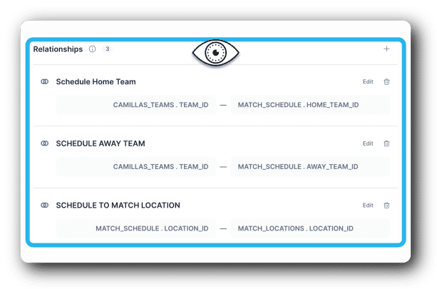

Be sure to click the __Save__ button in the upper-right corner of your model.

### 💬 More Sophisticated Chats

<h3>🥋 Ask More Sophisticated Questions</h3>

Now that we've defined the relationships between the tables, you can ask questions that require traversing several tables to get answers. Pretty Cool! Pretty Wow!

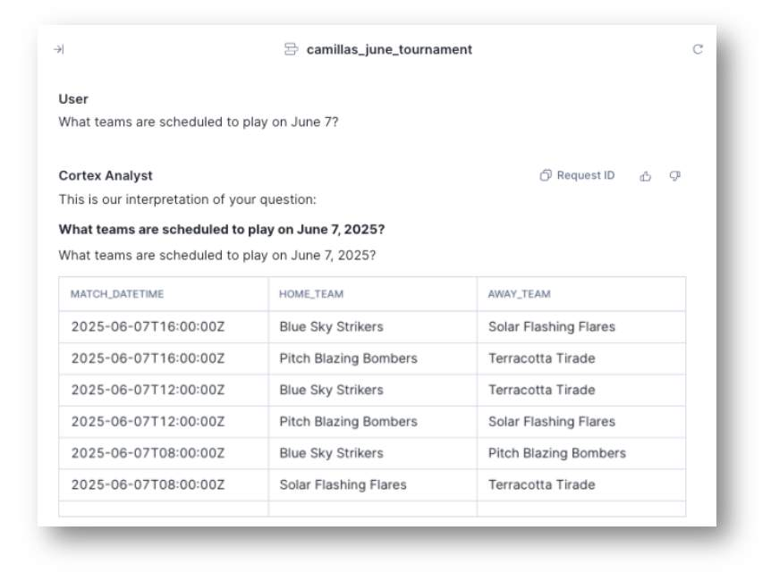

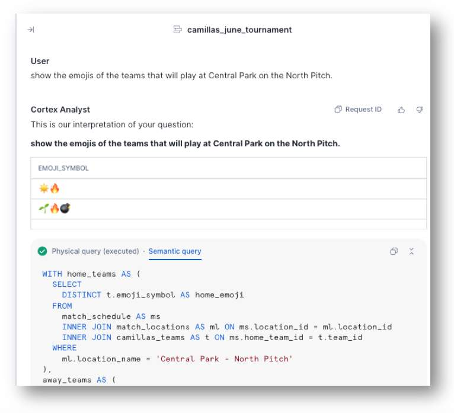

<h3>📓 You Can Do So Much More</h3>

In this workshop, we'll stop here, but there is much more you can do.  Check the Snowflake Documentation to learn more about cool ways to make Cortex Analyst even smarter.

Don't forget to save your model before you leave!!

### 🤖 DORA DSCW02

<h3>🤖 DORA Check!</h3>

<div class="lia-banner lia-banner--warn" role="alert">
  <span class="lia-banner__icon" aria-hidden="true">
    <svg xmlns="http://www.w3.org/2000/svg" width="28" height="28" viewBox="0 0 24 24" fill="none" aria-hidden="true">
      <circle cx="12" cy="12" r="9.5" stroke="currentColor" stroke-width="1.25" fill="none"/>
      <path d="M12 7.5v5.5" stroke="currentColor" stroke-width="1.5" stroke-linecap="round"/>
      <circle cx="12" cy="16.75" r="1" fill="currentColor"/>
    </svg>
  </span>
  <p class="lia-banner__msg">Never edit DORA code to get a green check. Edit your lab work.</p>
</div>

```SQL
-- Set your worksheet drop lists
-- This DORA Check Requires that you RUN two Statements, one right after the other
list @camillas_db.cortex_analyst.cortex_analyst_model_stage;

-- the above command puts information into memory that can be accessed using result_scan(last_query_id())
-- If you have to run this check more than once, always run the LIST command immediately prior
select grader(step, (actual = expected), actual, expected, description) as graded_results from (
 SELECT 'DSCW02' as step
 ,( select IFF(count(*)>0,1,0) 
    from table(result_scan(last_query_id())) 
    where "name" = 'cortex_analyst_model_stage/CAMILLAS_JUNE_TOURNAMENT.yaml') as actual
 , 1 as expected
 ,'Semantic Model Complete' as description
); 
```

### 🏁 Success & Next Steps


__Camilla__: Klaus?

__Klaus__: Hey Camilla!

__Camilla__: I did it!! I was able to build the database and then a semantic model based on my database tables. It was so fun!

__Klaus__: That's amazing. I knew you could do it.

__Camilla__: It’s crazy because now when I sit in my lectures, they make so much more sense. I think having the hands-on experience makes the lectures much more understandable.

__Klaus__: That’s great! And what about your tournament website? Are you getting fewer phone calls and emails now that your chatbot can answer questions for you?

__Camilla__: Yes! Zena added my semantic model as the information source on the chatbot. It is so good at answering questions now. I love this data science stuff so much. What can I try out next in Snowflake?

__Klaus__: Well, you could do some machine learning algorithm stuff. Like maybe forecasting or classification?

__Camilla__: Okay, yeah. How do I do that?

__Klaus__: Do you have any stats on your players that you want to use to predict how they will perform in the future?

__Camilla__: I have a lot of stats, but I’m not sure what will work best.

__Klaus__: Does your team practice at Cheesman Park tonight?

__Camilla__: Yes. Do you want to come? You could help me collect some stats tonight, and then I’ll show you everything I have.

__Klaus__: Yeah, that would be fun. See you tonight.

## Lesson 4 - Build a Model for Forecasting

### 📈 Stats for Forecasting

<h3>🎭 Gathering Stats for Analysis</h3>

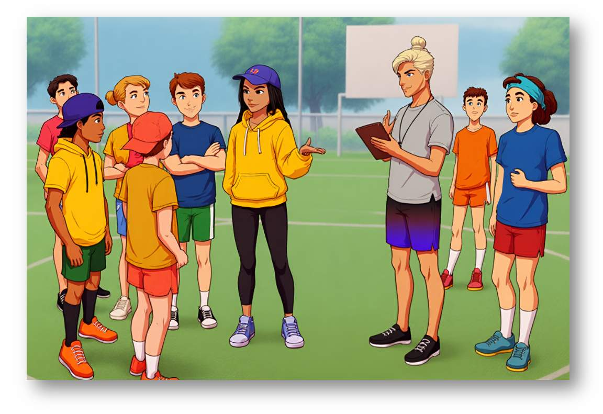

__Camilla__: Okay team, this is my friend Klaus.

__Klaus__: Hi!

__Kids__: [collective greetings]

__Camilla__: He's going to help us get better by tracking data about our practices.

__Goalie Kid__: Like what kind of data?

__Camilla__: Well, I always try to keep track of how many shots you take during practice and how many of those are goals. I also track your saves and some other things, when I have the time.

__Goalie Kid__: So what does the data tell you?

__Camilla__ Well, nothing so far because I haven't had time to sit down and analyze it.

__Goalie Kid__: Just let AI do it for you. AI can do anything!

__Camilla__: [laughs] Yeah, funny you should mention that. Klaus, can you tell them our plan?

__Klaus__: Sure. So, we are going to let AI do the work, but it's not quite that simple. AI isn't magic. We still have to get the data into a place and format so that AI can be used with it. AI doesn't just decide on it's own to track your performance out here and it doesn't know what questions your coach might want to answer. Maybe someday we'll have a drone that watches your practice that can gather stats, but right now --

__Another Kid__: Eww.

__Camilla__: I know. I feel the same way. I'm not sure we need a drone to watch us practice. Kinda creepy.

__Klaus__: Yeah, for today I'll be the one tracking your stats and then Camilla and I will use some AI tools to analyze your performance and possibly make some predictions.

__Goalie Kid__: Be sure to get all my saves!!

__Klaus__: I'll do my best.

__Camilla__: Okay time to get warmed up.

### 📈 Load the Practice Data for Model Version 1.0

<h3>🎯 Add Another Warehouse and Schema for Camilla</h3>

- Use the SYSADMIN role for all of these tasks.
- Create a new schema called FORECASTING in Camilla's Database.
- Create an eXtra-Small Warehouse and call it ML_WH.

<h3>🥋 Create a Table to Hold Camilla's Practice Session Observations</h3>

```SQL
create or replace table camillas_db.forecasting.practice_stats (
	practice_date timestamp_ntz,
	goals_scored number,
	goals_attempted number
);
```

<h3>🥋 Download Camilla's Data</h3>

Download <a href="./assets/stats_collected_at_practice.csv" download="stats_collected_at_practice.csv">Camilla's practice stats (CSV)</a>.

<h3>🎯 Upload Camilla's Data</h3>

You have learned multiple methods for loading data in earlier badges. Choose one of those now to load the CSV data into the table we just created.

Once the data is loaded, run a select statement on it.

<h4>Multiple Choice</h4>

How many rows did you load?

[[ ]] 10
[[ ]] 15
[[ ]] 105
[[ ]] 110
[[ ]] 155

<h4>Multiple Choice</h4>

What is the first practice date in the file?

[[ ]] 3rd of March, 2025
[[ ]] 30th of March, 2025
[[ ]] 3rd of May, 2025
[[ ]] 31st of May, 2025
[[ ]] 3rd of August, 2025
[[ ]] 31st of August, 2025

<h4>Multiple Choice</h4>

What is the last practice date in the file?

[[ ]] 3rd of March, 2025
[[ ]] 30th of March, 2025
[[ ]] 3rd of May, 2025
[[ ]] 31st of May, 2025
[[ ]] 3rd of August, 2025
[[ ]] 31st of August, 2025

### ➗ Dividing Up Our Data Set

<h3>📓 Preparing Data for Forecasting</h3>

To forecast how the players will perform at future practices, we want to begin by feeding Snowflake some historical data. But, we don't want to give it ALL the historical data. Want to hold back some of that data so that we can use it to validate our forecast!

We need to use MOST of our data to TRAIN the forecasting model. Then use the REMAINING data to VALIDATE or EVALUATE the model that we get back.

To divide the data easily, we'll just create two views.

<h3>🥋 Create Views for Model Training and then Validation</h3>

```SQL
-- make a view that uses data from march to july for training the model
create or replace view camillas_db.forecasting.train_model_practice_data(
	  practice_date,
	  goals_attempted,
	  goals_scored
) as
  select 
    practice_date, 
    goals_attempted,
    goals_scored
  from camillas_db.forecasting.practice_stats
  where practice_date < '2025-07-01';

-- make a view that uses data from july forward for validating the model
create or replace view camillas_db.forecasting.validate_model_practice_data(
	   practice_date,
	   goals_attempted,
	   goals_scored
) as
  select 
    practice_date, 
    goals_attempted,
    goals_scored
  from camillas_db.forecasting.practice_stats
  where practice_date >= '2025-07-01';
```

### 📈 Forecast Model version 1.0

<h3>🥋 Configure Your First Forecasting Model</h3>

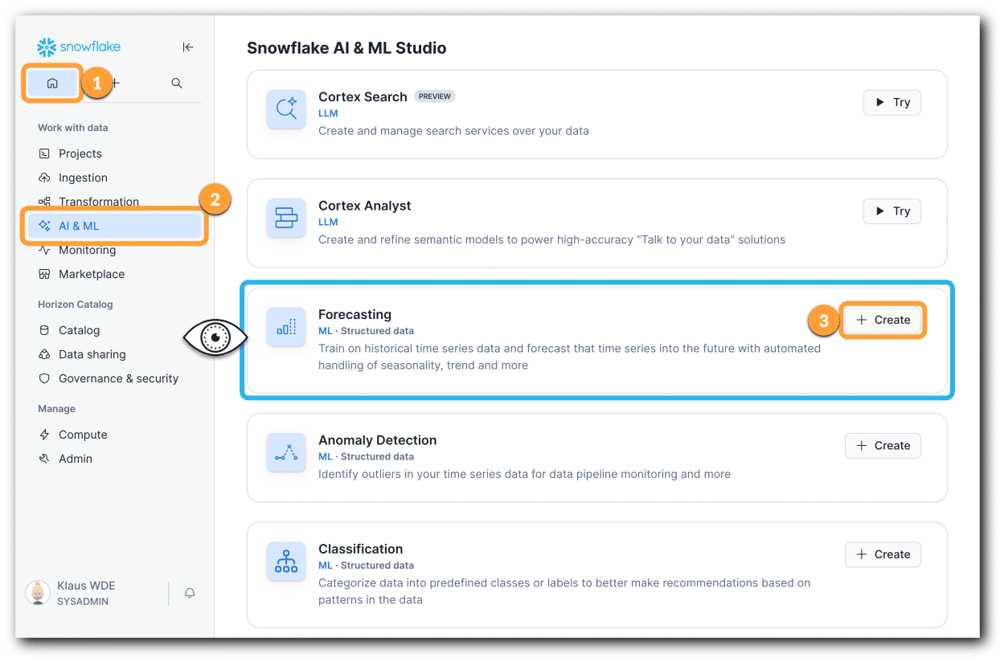

__COPY THIS__: camillas\_practice\_goal\_forecasting

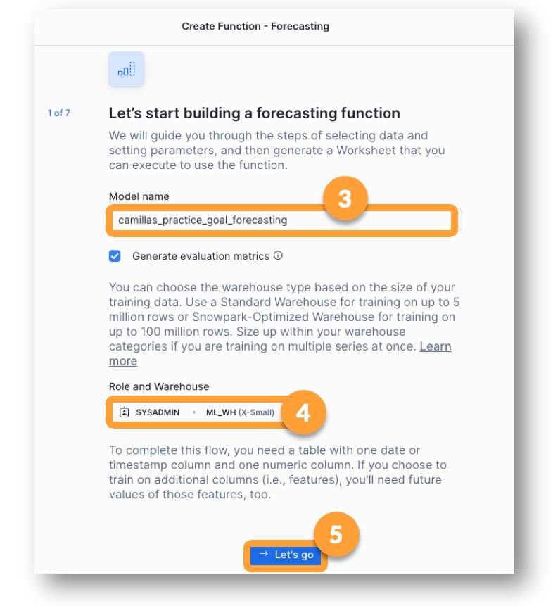

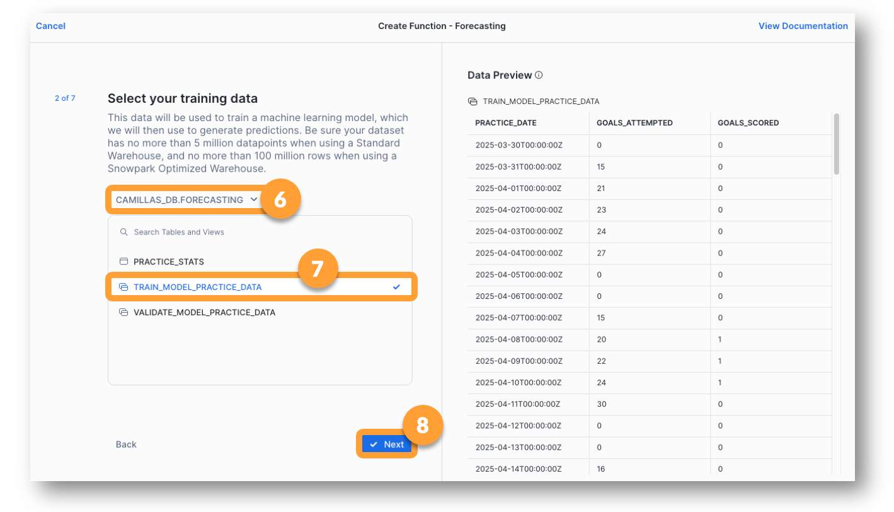

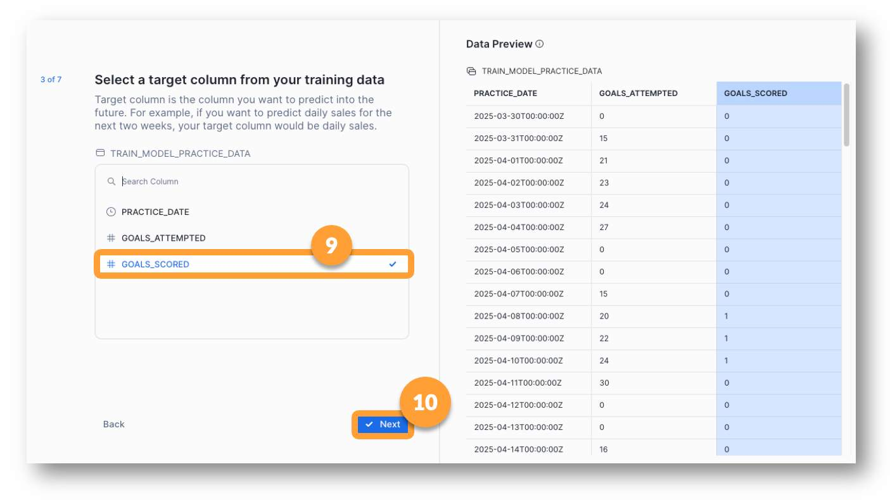

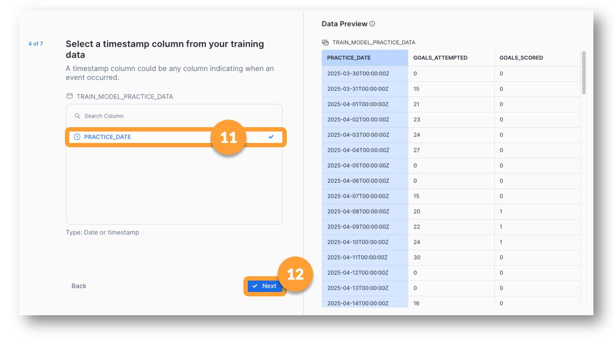

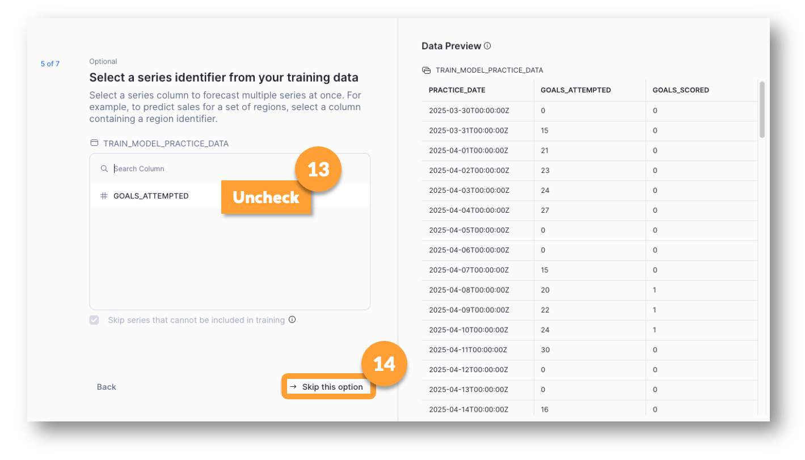

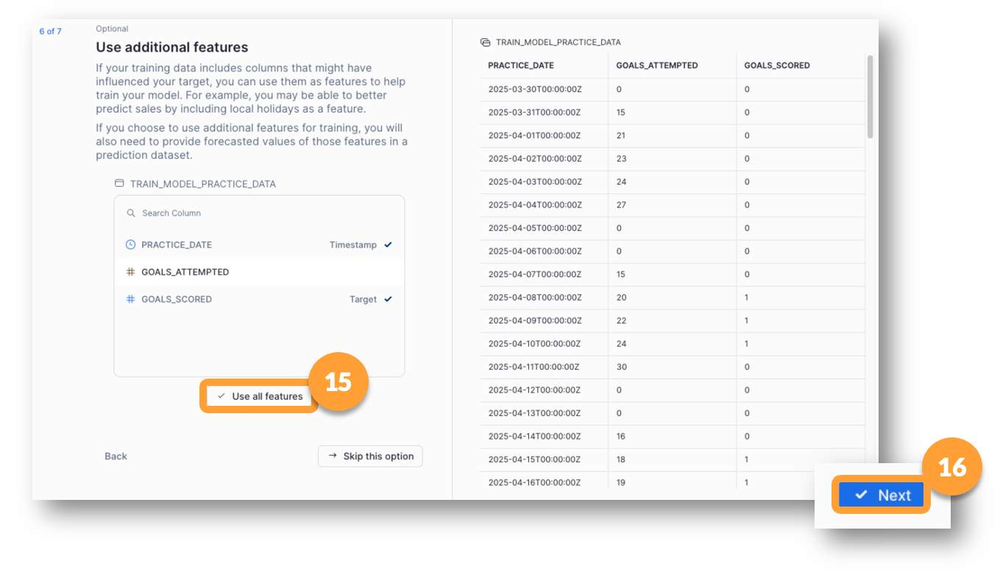

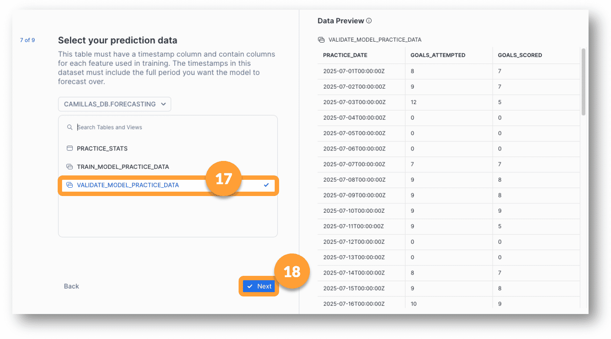

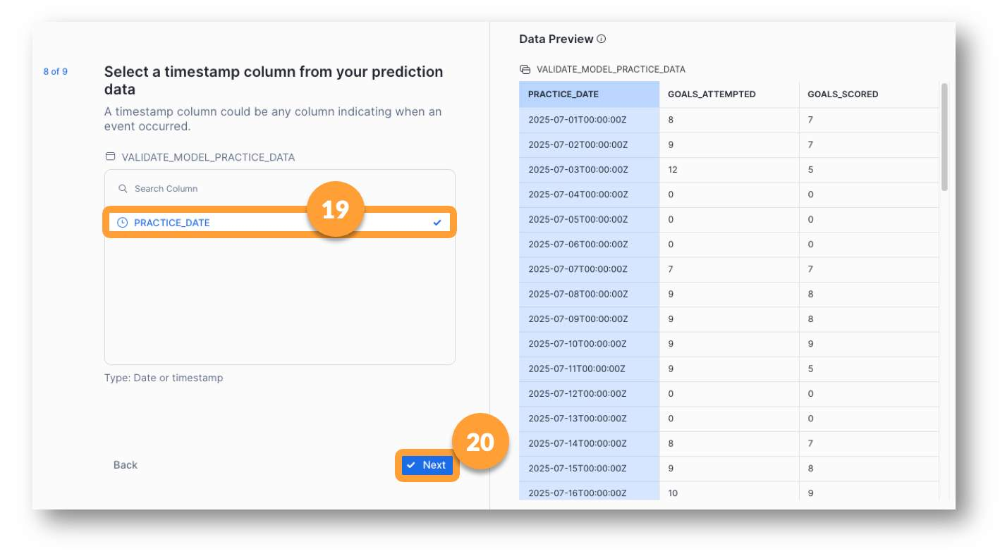

__COPY THIS__: first\_goals\_forecast

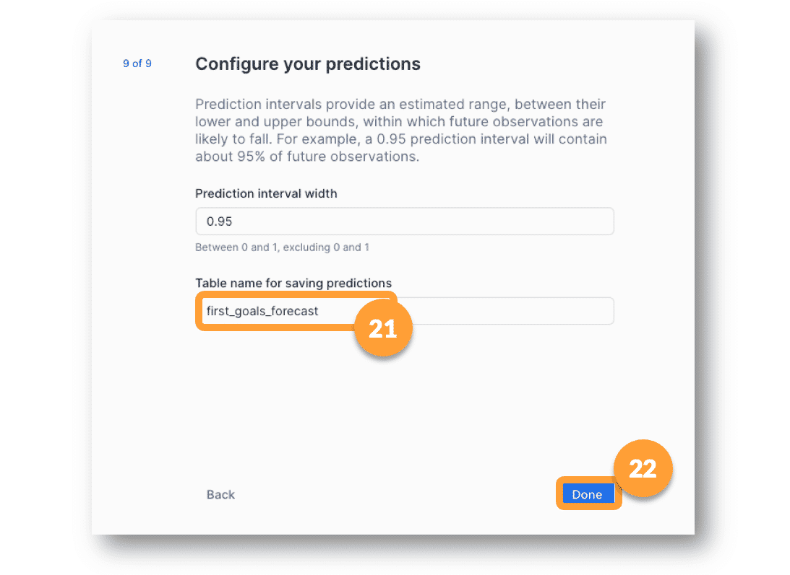

<h3>📓 What Am I Lookin' At Here?</h3>

We haven't actually built the forecast model yet. We've configured all the parameters using a wizard and now Snowflake has written up a worksheet full of SQL code for us.

In the next lab, we'll take a closer look at the code and we'll run some parts of it.

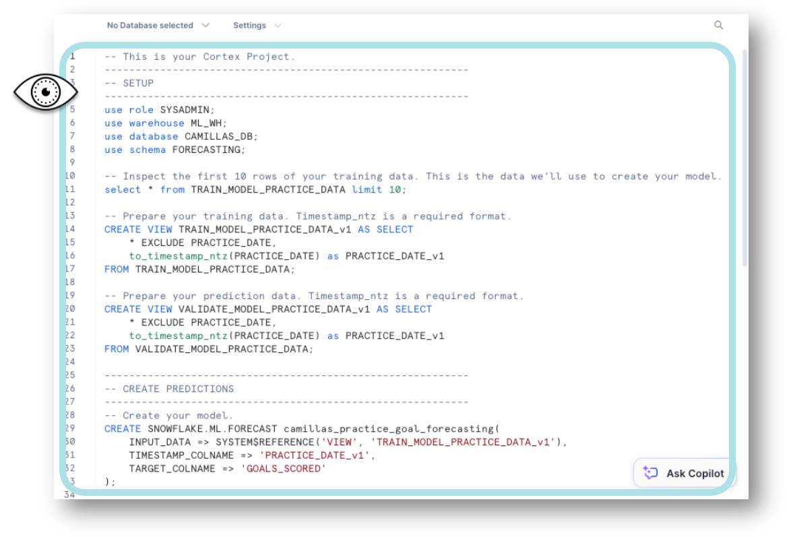

### 🏃‍♀️‍➡️ Running Our Model Code

<h3>🥋 Run the Context-Setting Code Portion</h3>


<h3>📓 No Need to Run ALL the Code</h3>

We already know what the data in our training table looks like, so running this line of code is optional.

```SQL
-- Inspect the first 10 rows of your training data
-- This is the data we'll use to create your model.
select * from TRAIN_MODEL_PRACTICE_DATA limit 10;
```

The __CREATE VIEW statements don't need to be run at all__. A forecast model requires that the table have a timestamp_ntz data type field.

The routine that builds this worksheet does an extra step, just in case. It creates a view and uses the view to convert a timestamp to NTZ. But our timestamp column is already NTZ, so we don't need to use the views nor the extra columns created by the views.

```SQL
-- Prepare your training data.  Timestamp_ntz is a required format
CREATE VIEW TRAIN_MODEL_PRACTICE_DATA_V1 AS SELECT  
    * EXCLUDE PRACTICE_DATE,
    to_timestamp_ntz(PRACTICE_DATE) as PRACTICE_DATE_v1
FROM TRAIN_MODEL_PRACTICE_DATA;

-- Prepare your prediction data.  Timestamp_ntz is a required format
CREATE VIEW VALIDATE_MODEL_PRACTICE_DATA_V1 AS SELECT  
    * EXCLUDE PRACTICE_DATE,
    to_timestamp_ntz(PRACTICE_DATE) as PRACTICE_DATE_v1
FROM VALIDATE_MODEL_PRACTICE_DATA;
```

<h3>🥋 Edit the Model Creation Code & Run It</h3>

Since we didn't create the view, we can repoint our code back at our original table and use our original PRACTICE_DATE field.

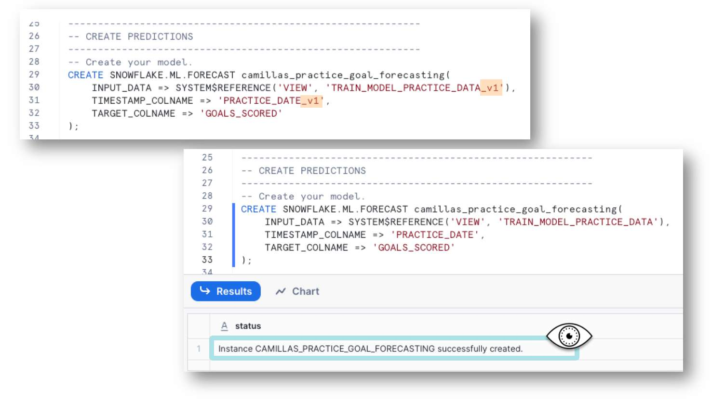

Model creation is not instantaneous. It may take a few minutes.

<h3>🎯 Use the Model to Create Predictions</h3>

Now that your model exists, we can run a code block that will apply our forecasting model to the validation data set.  Don't forget to edit the code references to the view and the column we did not need to create.

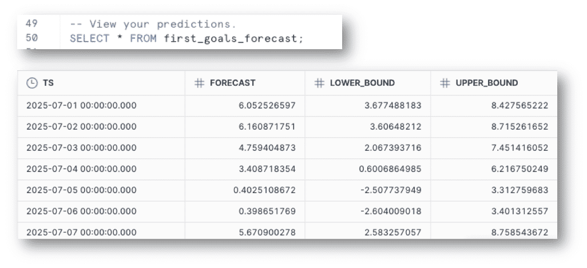

### 🔎 Viewing Our Predictions

<h3>📓 View The Predictions Table</h3>

__Running line 50 of the code is optional.__


Our model is fairly simple. If the players are getting better at kicking goals, we expect that their goals will go up over time. You can see that for July 1st, the model predicts that they players will combine for 6 goals during that practice session. Beyond that, our forecast says that even if the number of goals is not 6, there is a 95% chance it will be somewhere between 3 and 8 goals.

<h3>🥋 Run the Union Select</h3>

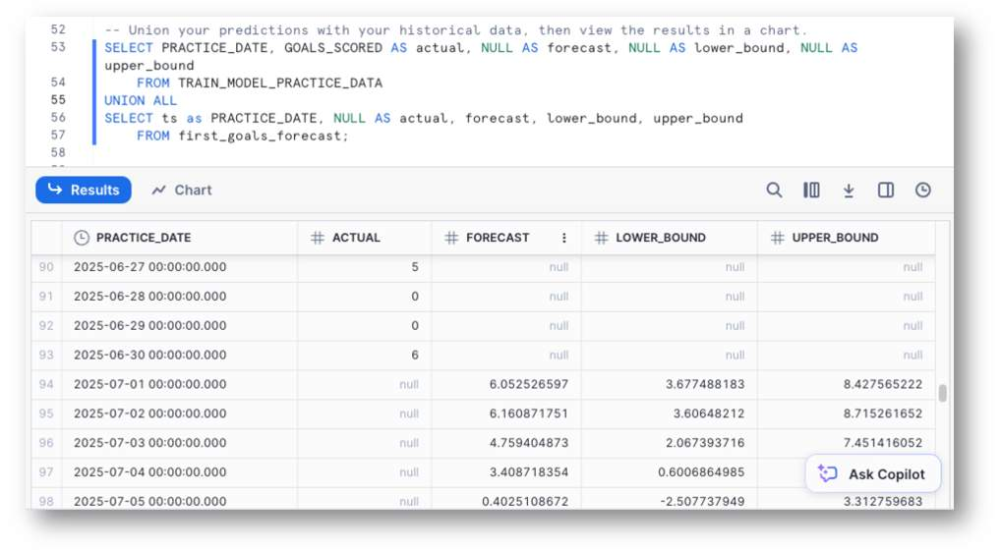

Once the results come back, take note of how the data from the training table looks different than the data from the forecast table. The idea is that where the actual data ends, the forecast begins. On the last day of June, we know there were 6 goals scored, so guessing that there would 6 goals on first of July seems reasonable.

<h3>🥋 Convert the Union Select Results to a Chart</h3>

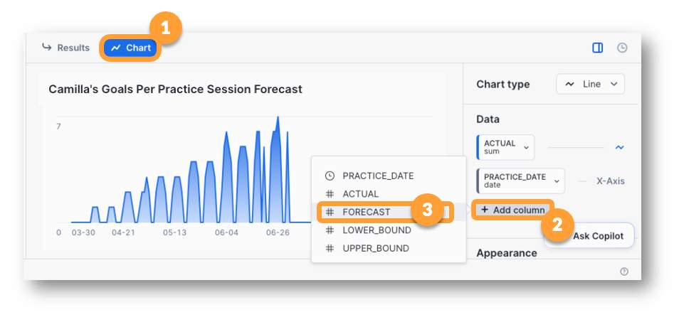

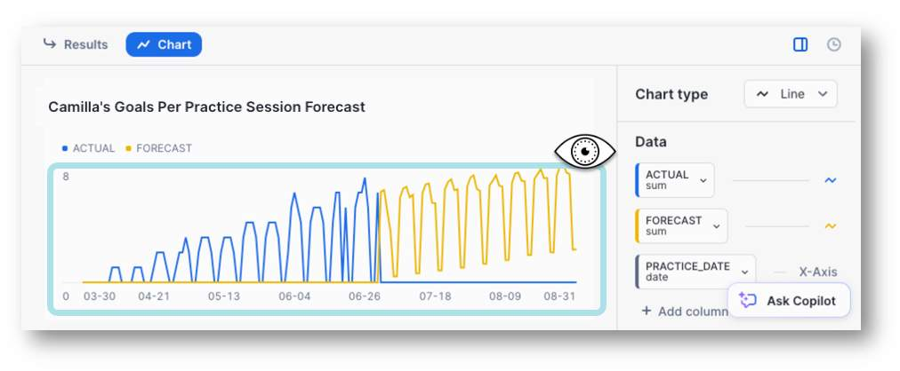


Klaus and Camilla have built a model that predicts how many goals the team might be scoring in future practice sessions.

__Klaus__: "So? What do you think? Is it weird that the yellow dips in the forecast don't return to the baseline while all the blue ones do?"

__Camilla__: "Yes, that's very weird."

__Klaus__: "What do you think is causing the dips? And could whatever causes it be getting less impactful?"

__Camilla__: "No, that's not likely. Those dips are caused by weekends! We don't practice on Saturday or Sunday and we don't have plans to start."

__Klaus__: "Of course! I can't believe I didn't take the day of the week into consideration. We can fix that really easily! Let's add the day of the week to our model and re-train it!"

__Camilla__: "I love this stuff!"

---

<h4>Multiple Choice</h4>

According to the results shown above, mark the true statements below.  

Select all that apply.

[[ ]] 6 goals are forecast for the 30th of June.
[[X]] 3 goals are forecast for the 4th of July.
[[ ]] 4 goals are forecast for the 5th of July.
[[ ]] The models' forecast has 95% confidence that July 4th goals will be between 2 and 8.
[[X]] The models' forecast has 95% confidence that July 7th goals will be between -2 and 9.

---

### 🤖 DORA DSCW03

<div class="lia-banner lia-banner--warn" role="alert">
  <span class="lia-banner__icon" aria-hidden="true">
    <svg xmlns="http://www.w3.org/2000/svg" width="28" height="28" viewBox="0 0 24 24" fill="none" aria-hidden="true">
      <circle cx="12" cy="12" r="9.5" stroke="currentColor" stroke-width="1.25" fill="none"/>
      <path d="M12 7.5v5.5" stroke="currentColor" stroke-width="1.5" stroke-linecap="round"/>
      <circle cx="12" cy="16.75" r="1" fill="currentColor"/>
    </svg>
  </span>
  <p class="lia-banner__msg">Never edit DORA code to get a green check. Edit your lab work.</p>
</div>

```SQL
-- Set your worksheet drop lists
-- DO NOT EDIT ANYTHING BELOW THIS LINE
select GRADER(step, (actual = expected), actual, expected, description) as
graded_results from (
   SELECT 'DSCW03' as step
   ,( select round(count(*)/iff(count(*)=0,1,count(*)),0) as tally
      from snowflake.account_usage.query_history
      where query_text like '%CREATE SNOWFLAKE.ML.FORECAST
      camillas_practice_goal_forecasting%'
      and execution_status = 'SUCCESS'
      ) as actual
   , 1 as expected
   ,'Created Forecast Model' as description
);
```

## Lesson 5 - Feature Engineering for Forecasting

### 📅 Add Day of Week Column to the Views

<h3>🥋 Create a New Training Data View and Add a Day of Week Column</h3>

```SQL
create or replace view camillas_db.forecasting.train_2_model_practice_data(
	practice_date,
	day_of_week,
	goals_attempted,
	goals_scored
) as
select 
practice_date,
dayname(practice_date) as day_of_week,
goals_attempted,
goals_scored
from camillas_db.forecasting.practice_stats
where practice_date < '2025-07-01';
```

<h3>🎯 Make a VALIDATE\_2\_ View</h3>

Using the same update pattern, create the VALIDATE_2_MODEL_PRACTICE_DATA view.

### 📈 Configure a New Forecasting Model

You can either __edit the code directly, or you can use the wizard to generate a new code worksheet__. But, if you want to edit the code directly, you'll need to figure out [how to add the SERIES as an attribute during model creation](https://docs.snowflake.com/en/user-guide/ml-functions/forecasting#label-analysis-forecasting-examples) and again when generating the predictions.

Use the same settings for the new model, except for the following changes (step numbers are given for those using the wizard):

1. Model Name: __camillas\_practice\_goal\_4cast\_w\_dayofweek__
2. Training Data: __Choose the 2nd version of the Training view__
5. Series Identifier: __The day of the week is the series identifier__

Then, with the generate predictions code block:

7. Prediction Data: __Choose the 2nd version of the Validation view__
9. Predictions Table Name: __second\_goals\_forecast__

### 🛠️ Create and Run Your New Model, View Your New Predictions

<h3>🥋 Try this Special Union Select Statement to Compare the Difference Day of Week Made in the Predictions</h3>

```SQL
select practice_date, goals_scored as actual, null as forecast_1, NULL as forecast_2
    from train_2_model_practice_data
UNION ALL
select ts as practice_date, NULL as actual, forecast as forecast_1, NULL as forecast_2
    from first_goals_forecast
UNION ALL    
select ts as practice_date, NULL as actual, null as forecast_1, forecast as forecast_2
    from second_goals_forecast;
```

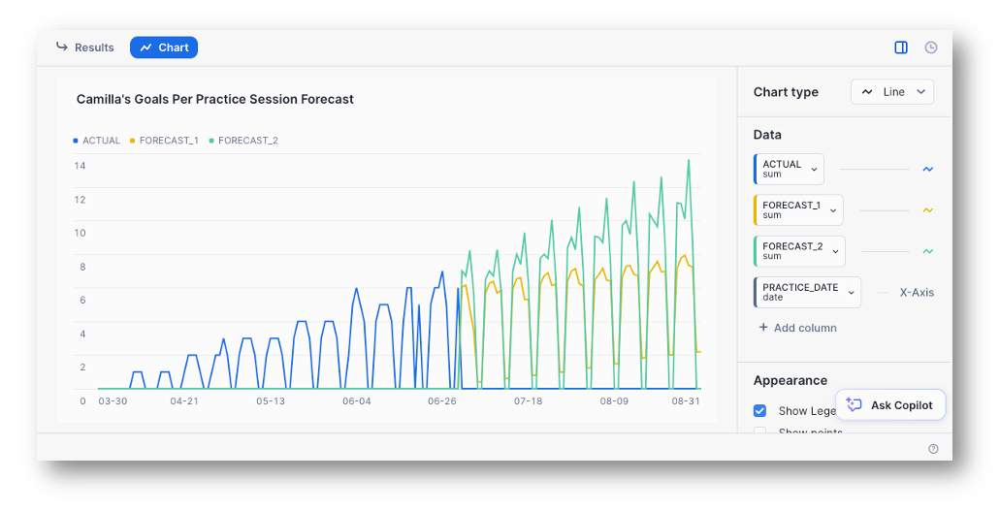

---


__Klaus__: "The yellow line is our first forecast prediction. The green one is the new prediction. The weekends look much better, don't you think?"

__Camilla__: "It does look better."

__Klaus__: "Can you think of any other factors we could add to improve the model?"

__Camilla__: "Not really. I want to redo this chart to include the actual data and compare that to the new forecast numbers!

__Klaus__: "That could be very interesting."

### 🔀 Interpreting Models for Continuous Improvement

<h3>🎯 Create a Union Statement and Chart that Uses the VALIDATION View</h3>

Remember that the validation data is the actual data for July and August so if we compare it to the predictions, it should be helpful.

- Modify the UNION ALL statement to use the validation view and remove the first forecast table.
- Run the new select.
- Convert it to a chart.
- Add the validation view data to the chart.
- Remove Forecast\_1


<h3>📓 What does Camilla see in the Actual vs Forecast View?</h3>

Now they have a third chart version.


__Klaus__: "Okay, looking that this version, what jumps out to you?

__Camilla__: "Oh yeah, we also don't practice on holidays! So June 19th and July 4th are holidays here in Denver - we didn't practice."

__Klaus__: "I'll add a IS_HOLIDAY feature to the model!"

__Camilla__: "Yeah, that's a great new feature to help with predictions!"

__Klaus__: "Look how in July and August, the yellow numbers continue to climb but the blue levels off. "

__Camilla__: "I think it's because my players have gotten better over the months but they only have time to score so many goals."

__Klaus__: "Okay so it is a ceiling effect. I thought it might be. Once they reach a certain accuracy, they're not going to be able to continue getting more and more goals!"

__Camilla__: "Right, because I only let them scrimmage for a certain portion of the practice. They don't score during stretching or during passing drills, stuff like that."

__Klaus__: "What about this weird  bump and spike shape we see? I see it more in the yellow forecasts but it appears in some of the actual data too."

__Camila__: "Oh, I think that's because sometimes my players come in very excited on Mondays and they score well. Then they levels off during the week, but on Fridays I encourage them to take more chances so they always end up attempting more goals. Would that explain it?"

__Klaus__: "It does seem like it could!!"

__Camilla__: "I'm really happy with this forecast and I learned so much!"

__Klaus__: "If you're happy, I'm happy!"


### 🤖  DORA DSCW04

<div class="lia-banner lia-banner--warn" role="alert">
  <span class="lia-banner__icon" aria-hidden="true">
    <svg xmlns="http://www.w3.org/2000/svg" width="28" height="28" viewBox="0 0 24 24" fill="none" aria-hidden="true">
      <circle cx="12" cy="12" r="9.5" stroke="currentColor" stroke-width="1.25" fill="none"/>
      <path d="M12 7.5v5.5" stroke="currentColor" stroke-width="1.5" stroke-linecap="round"/>
      <circle cx="12" cy="16.75" r="1" fill="currentColor"/>
    </svg>
  </span>
  <p class="lia-banner__msg">Never edit DORA code to get a green check. Edit your lab work.</p>
</div>

```SQL
-- Set your worksheet drop lists
-- DO NOT EDIT ANYTHING BELOW THIS LINE
select GRADER(step, (actual = expected), actual, expected, description) as graded_results from (
   SELECT 'DSCW04' as step 
   ,( select round(count(*)/iff(count(*)=0,1,count(*)),0) as tally
      from snowflake.account_usage.query_history
      where query_text like '%CREATE SNOWFLAKE.ML.FORECAST camillas_practice_goal_4cast%'
      and execution_status = 'SUCCESS'
     ) as actual 
   , 1 as expected 
   ,'Improved Forecast Model' as description
);
```

## Lesson 6 - Classification Machine Learning

### 💾 Load Player Data


Zena has invited Mel, Klaus and Camilla to watch Brazil play Germany in a match. Since all four of them are trying to improve their tech skills, they all have personal projects they are constantly collaborating on. So, while watching the game, they are also busy on their laptops.

Zena is working on a website for Mel's mother and another for Camilla's tournament.

Mel is developing a Streamlit app.

Camilla and Klaus are focused on building a Classification model using Snowflake.

Camilla has a big file of game stats for last year's players. These player records don't have assigned positions, but she knows enough to be able to infer what position they were likely to have been assigned just by studying their stats.

After assigning positions to the first 11 players in her list (she has data from 10 games each), she and Klaus build the table and upload her data into it. She will use this hand-coded data to train her classification model.

---

<h3>🎯 Create a Schema for Your Classification Model</h3>

- Use the __SYSADMIN__ role.
Create a new schema called __CLASSIFICATION__.

<h3>🥋 Create and Populate Classification Tables</h3>

```SQL
create or replace table camillas_db.classification.train_player_position (
	player_id number(38,0),
	position_code varchar(1),
	game number(38,0),
	minutes_played number(38,0),
	goals number(38,0),
	assists number(38,0),
	shots number(38,0),
	passes number(38,0),
	sprint_distance number(38,0),
	saves number(38,0),
	dribbles number(38,0),
	blocks number(38,0),
	claims number(38,0)
);
```

<h3>🥋 Download the Player Game Stats Data</h3>

Download this __<a href="./assets/train_player_positions.csv " download="stats_collected_at_practice.csv">train\_player\_positions.csv</a>__ file with game stats for 11 players and their field positions.

<h3>🎯 Load the File into the Table</h3>

You should have experience loading files from prior Hands-On Essentials Workshops.

### 💾 Load Unclassified Player Data

Now that the classified data is loaded, Camilla needs to load another file of players and game stats. These players' positions have not been assigned.

She wants Snowflake to use the patterns she's already established and see if it can apply those patterns and assign positions to the new data.  

She will build a new table and load the unclassified data.

<h3>🥋 Create and Populate Classification Tables</h3>

```SQL
create or replace table camillas_db.classification.unclassified_player_positions (
	player_id number(38,0),
	game_id number(38,0),
	mins_played number(38,0),
	goals_made number(38,0),
	assists number(38,0),
	shots number(38,0),
	passes number(38,0),
	sprint_distance number(38,0),
	saves number(38,0),
	dribbles number(38,0),
	blocks number(38,0),
	claims number(38,0)
);
```

<h3>🥋 Download the Player Game Stats Data</h3>

Download this __<a href="./assets/train_player_positions.csv " download="stats_collected_at_practice.csv">unclassified\_player\_data.csv</a>__ file with the game stats for 33 other players BUT NOT their field positions.

<h3>🎯 Load the File into the Table</h3>

You should have experience loading files from other Hands-On Essentials Workshops.

### 🤖 A Classification Machine Learning Model

<h3>🥋 Configure a Classification Model</h3>

Use Snowflake's AI & ML Studio Classification Wizard

- MODEL NAME: __player\_position\_classification__
- ROLE: __SYSADMIN__
- WAREHOUSE: __ML_WH__
- TRAINING DATA TABLE: __camilles_db.classification.train\_player\_position__
- TARGET COLUMN: __position\_code__
- DATA TO CLASSIFY: __unclassified\_player\_positions__
- OUTPUT TABLE NAME: __my\_player\_pos\_code\_classifs__

<h3>🥋 Run Parts of the Code</h3>

Read over the code. You can run all of it, or just parts of it.

We recommend:

- Set your context.
- Consider viewing the training and unclassified data you loaded.
- Definitely create the model. It's pretty important! (no need to edit this like we did during forecasting).
- When you run the code that calls SHOW_TRAINING_LOGS, don't be too worried if no logs are returned.
- Run the CTAS code that generates the classifications and combines it with the unclassified data into a new table.

<h3>🥋 View the Predictions Column</h3>

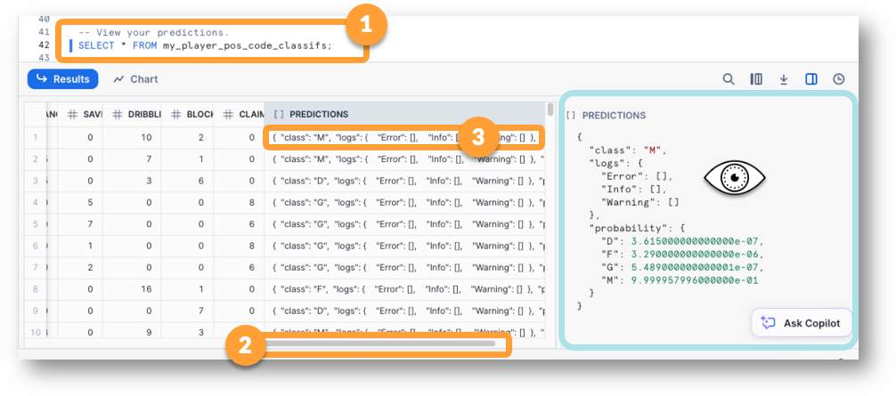

When they look at the JSON data in the prediction column, they can see that for this player, the classification model is guessing the player is a midfielder.

- The classification model assigned probabilities for each position code.
- The model says there's only a 36% chance this player is a Defender.
- There's a 32% chance the player is a Forward.
- There's a 54% chance the player is a Goalie.
- But there's a 99.9% chance the player is a Midfielder.

So, the classification outputs the highest percentage position as the CLASS and that is M.

### 📓 Review the Feature Importance Assignments

<h3>Mel & Camilla Catch Up</h3>

Mel and Camilla haven't seen each other in a few months. He's continued working on projects for his parents' smoothie shop and Camilla has been focused on her soccer team and tournament. Mel doesn't know much about data science and he doesn't know anything about soccer. He asks Camilla to tell him more about what she's been working on.


__Camilla__: So this is a classification model I just wrote in Snowflake. I wanted to use data science to figure out which position each player in the league played last season.

__Mel__:  Why didn't you have that information already? That seems like basic information.

__Camilla__: I don't know why it wasn't included, but I have game stats and I need their positions for next season's team assignments. Snowflake did a great job of predicting the positions for me and it took way less time than it would have taken me to do it manually.

__Mel__: So if you had done it yourself, how would you have approached it?

__Camilla__: Well, I always start with goalies because their stats are so different than other players.

__Mel__: Okay, I know what a goalie is from watching hockey!

__Camilla__: Yeah, so if a futebol player has saves and claims but no passes or dribbles, it's pretty obvious they're a goalie. Also, goalies nearly always play the entire game.

__Mel__: So you classify the goalkeepers first? That makes sense, then what?

__Camilla__: Well, with the remaining players I look for defenders. Defenders play near their own team's goal so they almost never take shots or score goals, but they make a lot of passes.

__Mel__: Okay, so then you assign the defenders next. That makes sense. It seems like you more or less do a process of elimination.

__Camilla__: Exactly!

__Mel__: So is that how Snowflake does its classification, too? Does Snowflake use a process of elimination?

__Camilla__: Um, I don't actually know how Snowflake does it. I was just about look at the FEATURE IMPORTANCE to see if Snowflake thinks saves and claims are really important features.

---

<h3>🥋 Run the Feature Importance Function on Your Classification Model</h3>

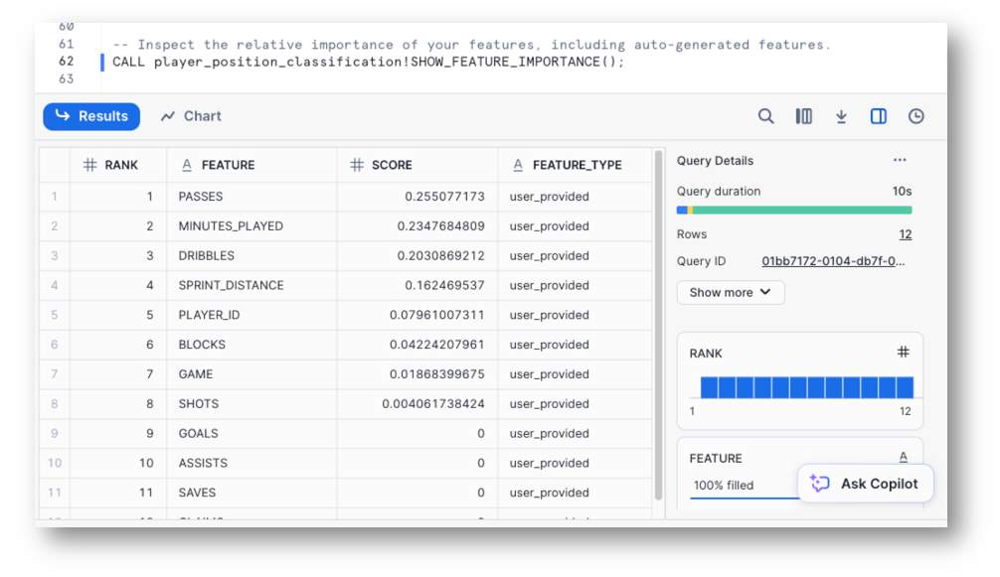

Then, navigate to the documentation page that tells you more about what the function reveals.


---

<h4>Multiple Choice</h4>

According to the screenshot in the proceeding lesson, which stat is the most important for classifying players according to their position?

[[ ]] Saves
[[ ]] Sprint Distance
[[ ]] Blocks
[[ ]] Assists
[[X]] Passes

---

<h4>Multiple Choice</h4>

According to the screenshot in the proceeding lesson, which stat is the most important for classifying players according to their position?

[[ ]] Saves
[[X]] Sprint Distance
[[ ]] Blocks
[[ ]] Assists
[[ ]] Passes

### 🤖 DORA DSCW05

<div class="lia-banner lia-banner--warn" role="alert">
  <span class="lia-banner__icon" aria-hidden="true">
    <svg xmlns="http://www.w3.org/2000/svg" width="28" height="28" viewBox="0 0 24 24" fill="none" aria-hidden="true">
      <circle cx="12" cy="12" r="9.5" stroke="currentColor" stroke-width="1.25" fill="none"/>
      <path d="M12 7.5v5.5" stroke="currentColor" stroke-width="1.5" stroke-linecap="round"/>
      <circle cx="12" cy="16.75" r="1" fill="currentColor"/>
    </svg>
  </span>
  <p class="lia-banner__msg">Never edit DORA code to get a green check. Edit your lab work.</p>
</div>

```SQL
-- Set your worksheet drop lists
-- This DORA Check Requires that you RUN two Statements, one right after the other
call camillas_db.classification.player_position_classification!SHOW_FEATURE_IMPORTANCE();

-- the above command puts information into memory that can be accessed using result_scan(last_query_id())
-- If you have to run this check more than once, always run the LIST command immediately prior
select grader(step, (actual = expected), actual, expected, description) as graded_results from (
 SELECT 'DSCW05' as step
 ,( select count(*) from table(result_scan(last_query_id())) where FEATURE in ('PASSES','MINUTES_PLAYED','DRIBBLES','ASSISTS', 'SAVES', 'CLAIMS')
  ) as actual
 , 6 as expected
 ,'Classification Model Complete' as description
);
```

### 🎉 Badge Time!

Congratulations! You made it to the end!

As long as you have met all the requirements, your badge will be automatically issued! Staff only gets involved in the rare instance that something in our automated flow has gone wrong. The DSCW badge goes out to hundreds of learners every week so please make sure you have checked all requirements and fixed issues on your own. The app is designed to help you help yourself!

<h3>🤖 Check in with DORA!</h3>

If you've successfully completed all of the DSCW DORA Tests, you will be issued the badge for this course.

Take a moment to check in with DORA by logging into the YSA App: [ https://ysa.snowflakeuniversity.com](https://ysa.snowflakeuniversity.com).

- __Double-check your email.__ Did you spell it correctly?
- __Double-check your display name.__ Is that how you want it to appear on your badge? You can use accents and any unicode characters so make your name look exactly how you want it to appear!
- __Make sure you have a link record__ that includes your ACCOUNT ID AND ACCOUNT LOCATOR. Without both pieces of information in the link record, your badge will be blocked.
- __Check your record of DORA Lab Checks.__  You should see all DORA Tests (DSCW01 to DSCW05) listed as both PASSING and VALID.  If you're missing a test, or one of them shows PASSING but NOT VALID, or vice versa, revisit that lesson and re-do the work / re-run the test.
- If you did everything above correctly, you will see DSCW listed as one of the 'Badges Awarded' entries.
- Note that it may take up to an hour before you complete the coursework and when you receive your badge via email notification.

<h3 class='text-center'>🎉  Thanks for completing the course, and congratulations!  🎉</h3>